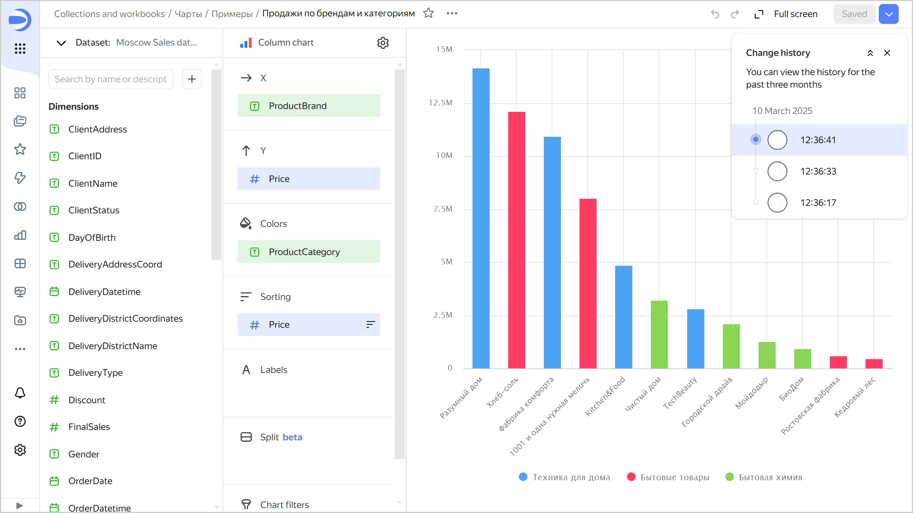
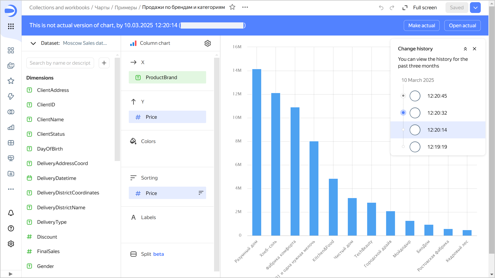
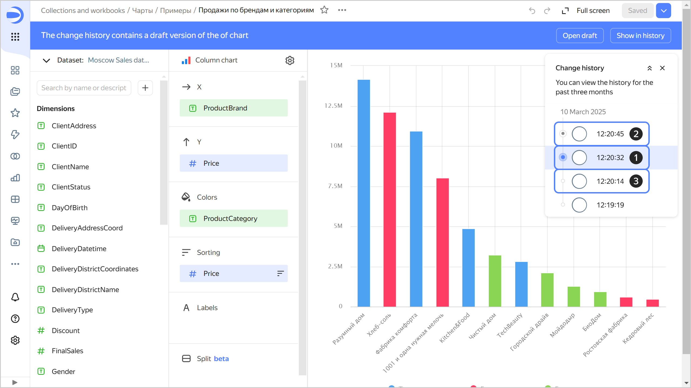
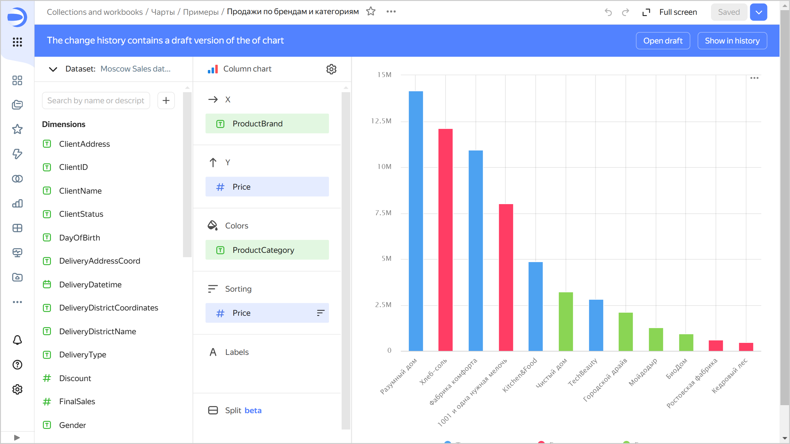

# Versioning

Chart versioning means storing the history of chart configuration changes through versions. A list of versions is available to users with the lowest edit permission for the chart.

To go to the list of versions, click the  icon at the top of the screen and select **Change history**.

To select a version from the list, click it. The version number will be displayed in the `revId` parameter in the chart address string. Clicking a link with the version number in the `revId` parameter will open the relevant version of the chart.

When editing within the current version, you can undo/redo any change you have made. To do this, click:

*  in the top-right corner of the screen or press **Ctrl** (**Cmd**) + **Z** to undo changes.
*  in the top-right corner of the screen or press **Ctrl** (**Cmd**) + **Shift** + **Z** to redo changes.

Unsaved changes in the current version are reset:

* When refreshing the page.
* When saving a chart.
* When switching to another version.

## Version types {#version-types}

All versions fall into the following types:

1. **Current**: This is the most recently saved version of a chart.

   The version is displayed:
   
   * To all users on dashboards.
   * When navigating to a chart.
   * When opening a chart in a workbook.
   * When using the dashboard context menu to open a chart for editing.
   
   Only one chart version can be current.

   A user with **{{ permission-write }}** permissions can make any chart version current.
  
   
  
   When updating any version, except a draft, a new chart version is created.

   
  
1. **Draft**: This is a version with unsaved chart changes. Common users do not see changes being made to a draft. This enables you to hide chart edits until you release a new version. A chart can only have one draft. 
   When you open a draft, a panel appears at the top indicating the version type, creation date and time, and login of the version author. There are buttons in the right-hand panel:

   * **Make current**: Turns the draft into the current version. The version current at the time will become outdated.
   * **Open current**: Opens the current version.

   
   
   

   

   To create a draft after editing a chart, click the down arrow in the top-right corner and select **Save as draft**.

   If there is a draft version of the chart, you can open it right away if you add the `unreleased=1` parameter to the URL.

   You can display a draft version of your chart on the dashboard. To do this, [add](../../operations/chart/add-parameters.md) the `unreleased` parameter set to `1` to the widget parameters on the dashboard for this chart.

1. **Outdated**: This is a version that is neither current nor a draft.  
   When you open an outdated version, a panel appears at the top indicating the version type, creation date and time, and login of the version author. There are buttons in the right-hand panel:

   * **Make current**: Turns the currently outdated version into the current one. The current version and the draft (if any) will become outdated.
   * **Open current**: Opens the current version.

   

   

   



You can share any chart version by adding the `revId` parameter to the chart link, e.g., `?revId=zac5m4edoaqqr`.



## Creating a new version {#version-create}

A new version is automatically created:

* In the current chart version edit mode, after you click **Save** (which creates a new current version) or  → **Save as draft** (which creates a new draft version).
* In the draft edit mode or non-current chart version edit mode, after you click **Save as draft** (which creates a new draft version) or  → **Save and make current** (which creates a new current version).
* In draft or non-current chart version view mode, after you click **Make current**.

You will also get a new version if you change chart configuration as follows:

* Edit the chart settings you can access by clicking  at the top of the screen.
* Add, rename, or delete chart fields.
* Add, rename, or delete chart fields.

## Editing versions {#version-edit}

You can edit any version of a chart.

### Editing a current version {#actual-version-edit}

If a chart has a draft, when you open its current version for editing, you will see a message in the top panel informing there is a draft in the change history.

Click the following:

* **Open draft**: To navigate to the draft.
* **Show in history**: To display the list of versions.

### Editing a draft {#irrelevant-version-edit}

To edit a draft, select it in the version list. To save your draft edits, at the top right, click:

* **Save as draft**: New draft will be created. The current draft will become an outdated version.
* Click  → **Save as copy** to create a new chart.
*  → **Save and make current** to create a new current version and make all other versions outdated.

### Editing an outdated version {#current-version-edit}

To edit an outdated version, select it from the list of versions. To save edits to an outdated version, at the top right, click:

* **Save as draft**: Draft will be created from the edited version. The current draft will become an outdated version.
* Click  → **Save as copy** to create a new chart.
*  → **Save and make current** to create a new current version and make all other versions, including the draft, outdated.

## Limitations {#restrictions}

* The change history only contains a list of chart versions and includes the version type, save date and time, and the author of the edits.
* Chart versions do not include changes to access permissions; this operation is performed separately from chart edits.
* Versions do not display a list of changes. You can only view the saved status of the chart configuration.

