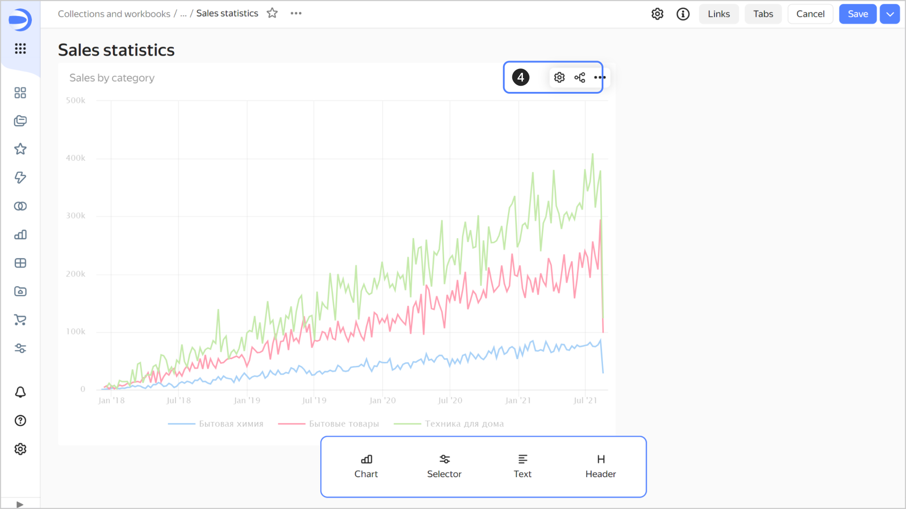
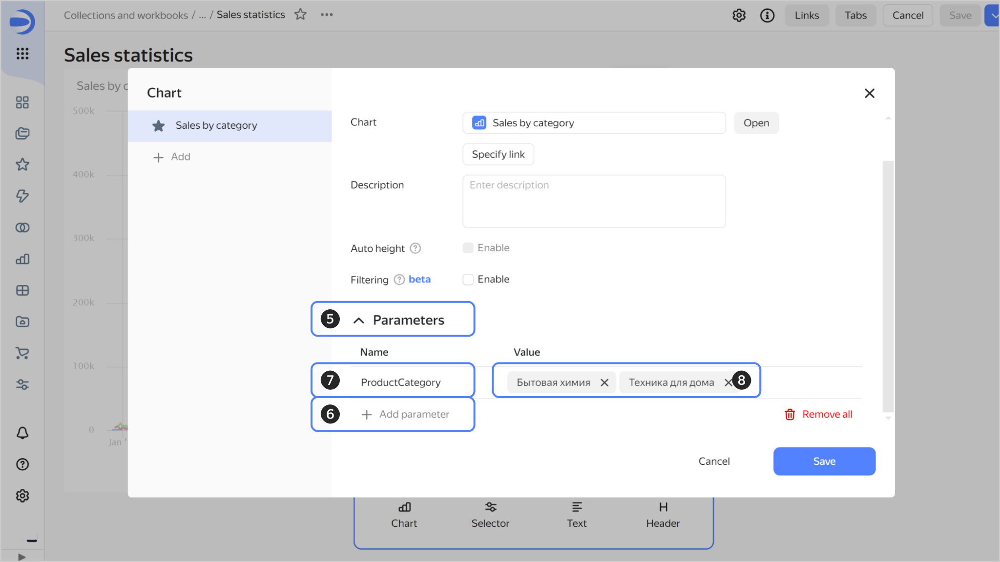
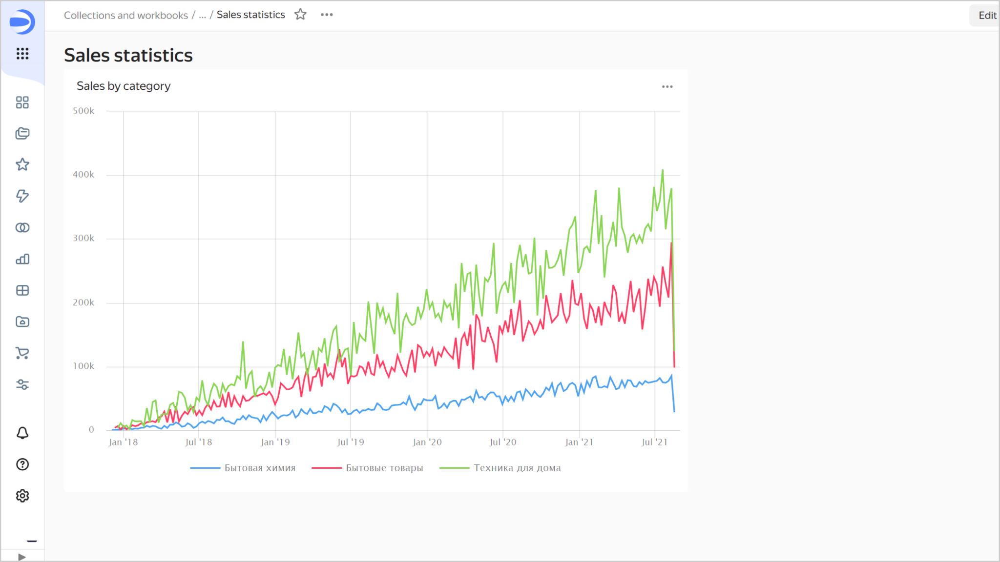
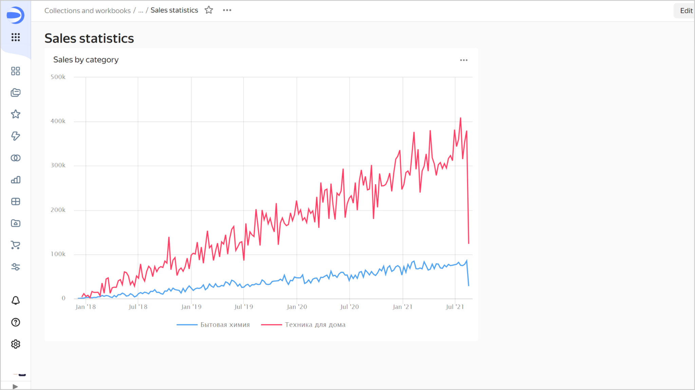
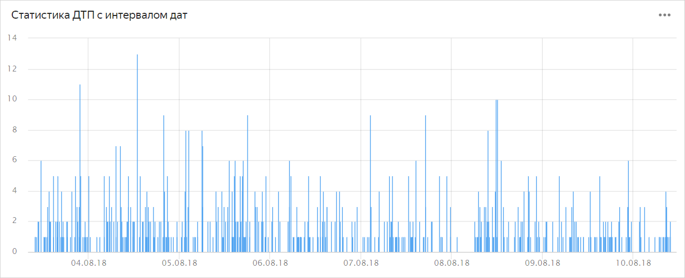

# Adding parameters in dashboard chart settings

To set a [parameter](../../dashboard/dashboard_parameters.md):

1. In the left-hand panel, click  **Dashboards** and select the dashboard you need. If you do not have a dashboard, [create one](../dashboard/create.md).
1. In the top-right corner, click **Edit**.
1. Select a chart for which you want to set a new parameter.
1. In the top-right corner of the chart, click .

   

1. In the window that opens, click  **Parameters**.
1. Click  **Add parameter** at the bottom of the list.
1. In the **Name** column, enter the parameter name (key).
1. In the **Value** column, click  and set a value for the parameter. You can set multiple values.

   

1. Click **Save**.
1. In the top-right corner of the dashboard edit window, click **Save**.









#### Example of parameters with intervals {#parameter-interval-examples}



To set the date and time [interval](../../dashboard/dashboard_parameters.md#interval) between `03-08-2018 09:00:00` and `10-08-2018 10:00:00`, set the parameter to `__interval_2018-08-03T09:00:00_2018-08-10T10:00:00`.





To set the date and time interval from the beginning of the last week of 2018 until today, set the parameter to `__interval_2018-12-23___relative_+0d`.

To build relative statistics from the beginning of the year, change `__relative_-0d` to `__relative_-0y_sy`.



Note: If no casting is specified, then for the units of one day and higher, the time is cast to the start of the day, that is, `00:00:00.000`, while casting to the current time is used for smaller time units.



