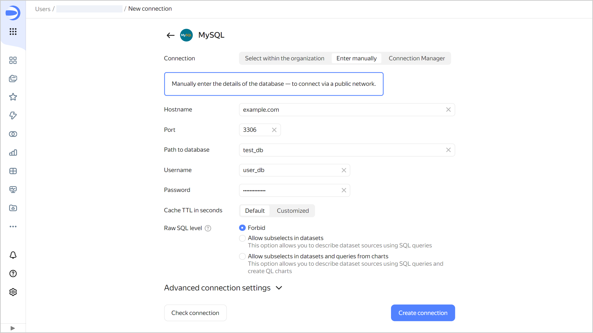

# Creating a {{ MY }} connection

To create a {{ MY }} connection:

1. Go to the [workbook](../../workbooks-collections/index.md) page or create a new one.
1. In the top-right corner, click **Create** → **Connection**.
1. Select a **{{ MY }}** connection.
1. Specify the connection parameters for the external {{ MY }} database:

   

   

1. (Optional) Test the connection. To do this, click **Check connection**.
1. Click **Create connection**.
1. Enter a name for the connection and click **Create**.

## Additional settings {#additional-settings}


