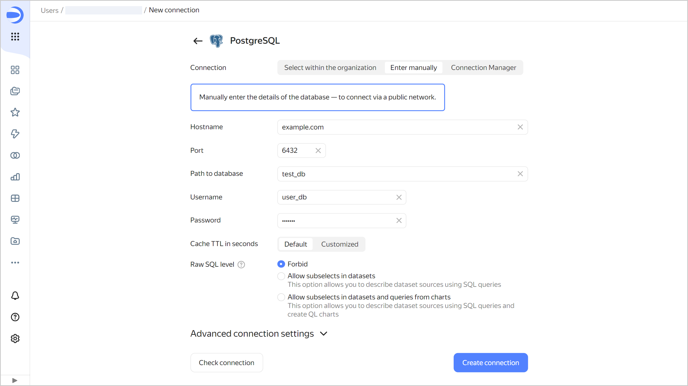
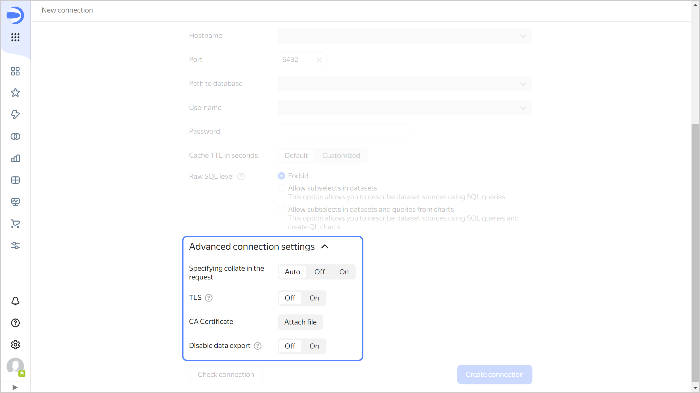

# Creating a {{ PG }} connection

To create a {{ PG }} connection:

1. Go to the [workbook](../../workbooks-collections/index.md) page or create a new one.
1. In the top-right corner, click **Create** → **Connection**.
1. Select a **{{ PG }}** connection.
1. Specify the connection parameters for the external {{ PG }} database:

   

   

1. (Optional) Test the connection. To do this, click **Check connection**.
1. Click **Create connection**.
1. Enter a name for the connection and click **Create**.

## Additional settings {#postgresql-additional-settings}

You can specify additional connection settings in the **Advanced connection settings** section:

* **Setting collate in a query**: To explicitly define a collation for DB queries, select a mode:

  * **Auto**: Default setting is used, {{ datalens-short-name }} decides whether to enable the `en_US` locale.
  * **On**: {{ datalens-short-name }} setting is used, the `en_US` locale is specified for individual expressions in a query. This makes the server use the appropriate sorting logic, regardless of the server settings and specific tables. Use the {{ datalens-short-name }} setting if the DB locale is incompatible with {{ datalens-short-name }} performance. 
  * **Off**: Default setting is used, {{ datalens-short-name }} only uses the existing parameters of the DB locale.

* **TLS**: Indicates that TLS should be used. When the option is enabled, the `sslmode` parameter is set to `required`. When the option is disabled, the parameter is set to `prefer`.
* **CA Certificate**: To upload a certificate, click **Attach file** and specify the certificate file. When the certificate is uploaded, the field shows the file name.
* 

