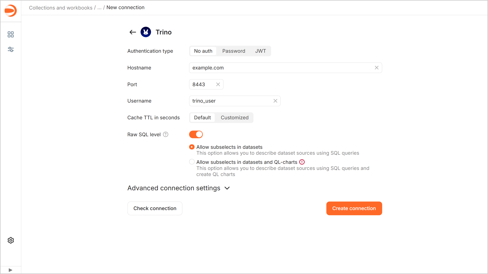
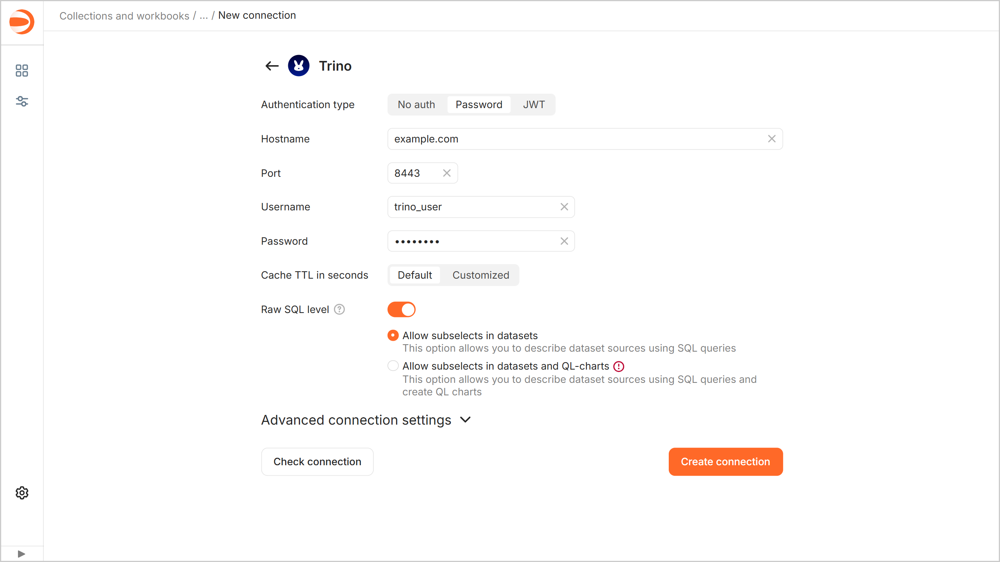
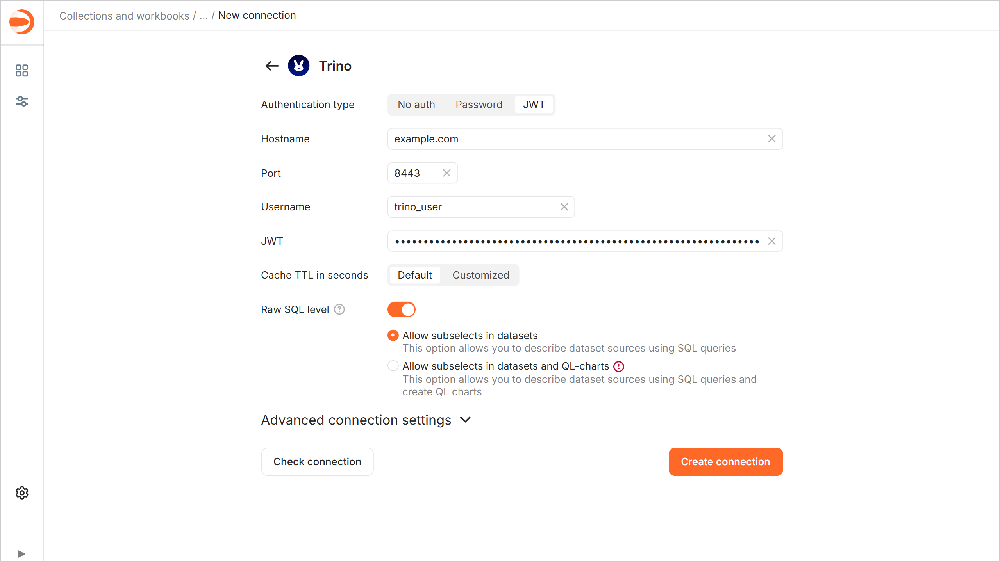
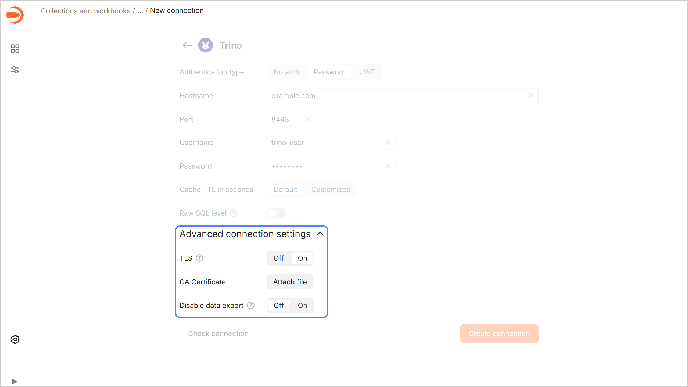

# Creating a {{ TR }} connection

To create a {{ TR }} connection:

1. Go to the [workbook](../../workbooks-collections/index.md) page or create a new one.
1. In the top-right corner, click **Create** → **Connection**.
1. Select a **{{ TR }}** connection.
1. Select the authentication mode and specify the connection parameters:

   

   - Without authentication {#noauth}

     * **Hostname**. Specify the {{ TR }} coordinator path or IP address.
     * **Port**. Specify the {{ TR }} connection port. The default port is 8443.
     * **Username**. Specify the username for the {{ TR }} connection. (If authentication is disabled, you can use any username as it will not affect the connection. The field value will be sent together with requests to the source.)
     * **Cache TTL in seconds**. Specify the cache time-to-live or leave the default value. The recommended value is 300 seconds (5 minutes).

     

     

   - Password {#password}

     * **Hostname**. Specify the {{ TR }} coordinator path or IP address.
     * **Port**. Specify the {{ TR }} connection port. The default port is 8443.
     * **Username**. Specify the username for the {{ TR }} connection.
     * **Password**. Enter the password for the specified user.
     * **Cache TTL in seconds**. Specify the cache time-to-live or leave the default value. The recommended value is 300 seconds (5 minutes).

     

     

   - JWT {#jwt}

     * **Hostname**. Specify the {{ TR }} coordinator path or IP address.
     * **Port**. Specify the {{ TR }} connection port. The default port is 8443.
     * **Username**. Specify the username for the {{ TR }} connection.
     * **JWT**. Specify a JWT.
     * **Cache TTL in seconds**. Specify the cache time-to-live or leave the default value. The recommended value is 300 seconds (5 minutes).

     

     

   

1. Optionally, test the connection. To do this, click **Check connection**.
1. Click **Create connection**.
1. Enter a name for the connection and click **Create**.

## Additional settings {#additional-settings}

You can specify additional connection settings in the **Advanced connection settings** section:

* **TLS**: If this option is enabled, {{ TR }} is accessed via `HTTPS`; if not, `HTTP`.
* **CA Certificate**: To upload a certificate, click **Attach file** and specify the certificate file. When the certificate is uploaded, the field shows the file name.
* 
* 



So far the [UNNEST](../../../datalens/function-ref/UNNEST.md) function has not been implemented for {{ TR }}.



