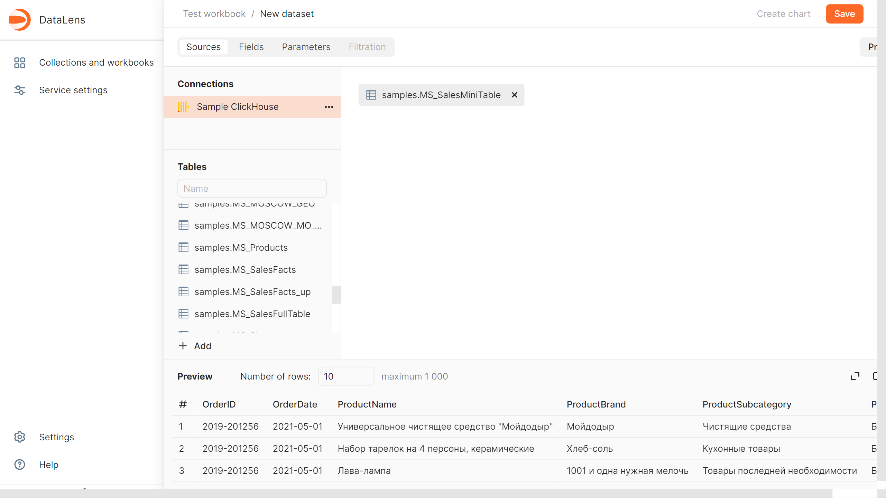
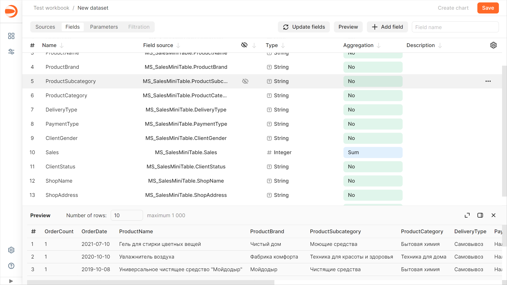
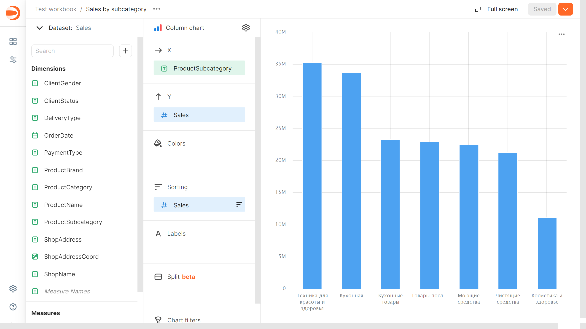
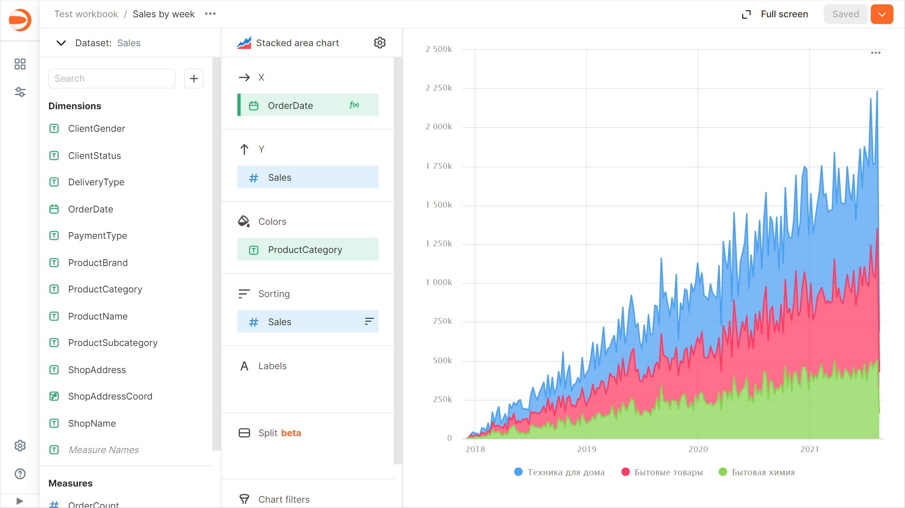
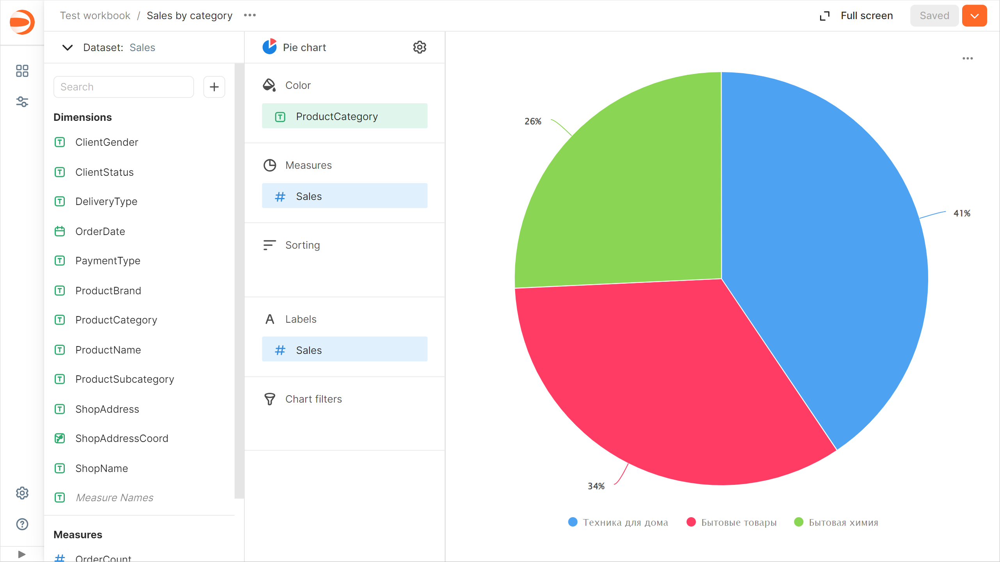
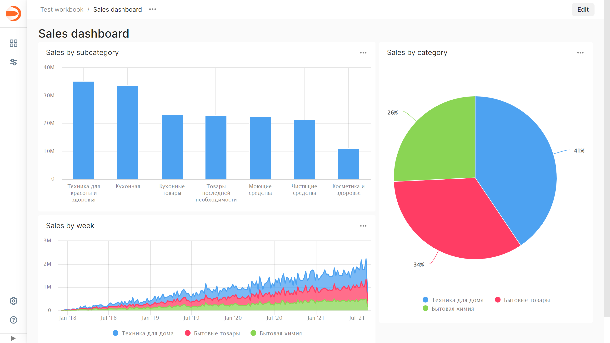
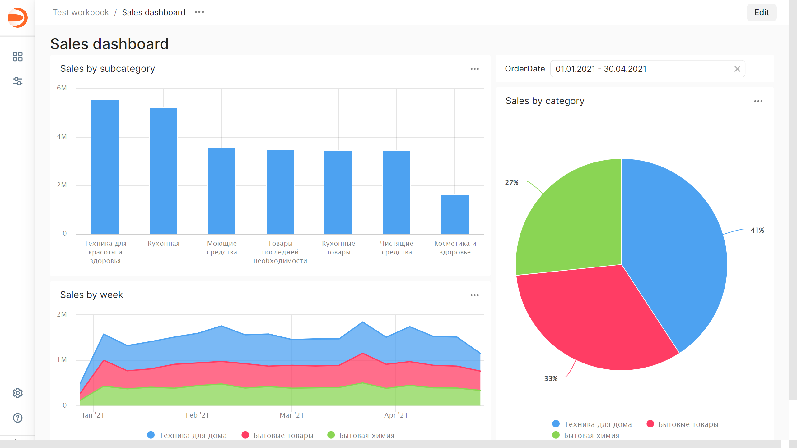

# Getting started with {{ datalens-short-name }}


In this tutorial, you will deploy {{ datalens-short-name }} locally, create your first [dataset](concepts/dataset/index.md), build several [charts](concepts/chart/index.md) for data visualization, and place them on a [dashboard](concepts/dashboard.md).

## Deploy {{ datalens-short-name }} {#create-datalens}

To deploy {{ datalens-short-name }} locally, just run multiple containers using [Docker Compose](https://docs.docker.com/compose/):

1. If you do not have Docker, install it by following the guide for your platform:

   * [macOS](https://docs.docker.com/desktop/install/mac-install/)
   * [Linux](https://docs.docker.com/engine/install/)
   * [Windows](https://docs.docker.com/desktop/install/windows-install/)

1. Run the following commands:

   ```bash
   git clone https://github.com/datalens-tech/datalens
   cd datalens
   HC=1 docker compose up
   ```

   The last command will run all containers required to start {{ datalens-short-name }}. You can execute it with a parameter for connecting an external database:

   ```bash
   METADATA_POSTGRES_DSN_LIST="postgres://{user}:{password}@{host}:{port}/{database}" HC=1 docker compose up
   ```

   

   [Highcharts](https://github.com/highcharts/highcharts/blob/master/readme.md) is a patented commercial product. If you enable Highcharts in your {{ datalens-short-name }} instance (with the `HC=1` variable), make sure to comply with the [license](https://github.com/highcharts/highcharts/blob/master/license.txt).

   

1. Open the {{ datalens-short-name }} GUI at `http://localhost:8080`.

Once you run {{ datalens-short-name }}, you can:

* Review demo examples
* Attach data [sources](concepts/connection.md)
* Build custom [dashboards](concepts/dashboard.md)

The first release of the open-source version includes everything you need to try {{ datalens-short-name }} features in your infrastructure. The [repository](https://github.com/datalens-tech/datalens/) currently hosts the service core, a set of key connectors ([{{ PG }}](operations/connection/create-postgresql.md), [{{ CH }}](operations/connection/create-clickhouse.md), and [{{ ytsaurus-name }}](operations/connection/chyt/create-chyt.md)), and the main interface components.

## Create a workbook {#create-workbook}

1. Go to the {{ datalens-short-name }} home page.
1. In the left-hand panel, select  **Collections and workbooks**.
1. In the top-right corner, click **Create** → **Create workbook**.
1. Enter a name for the workbook.
1. Click **Create**.

## Create a connection {#create-connection}



## Create a dataset {#create-dataset}

1. In the top-right corner, click **Create dataset**.
1. Drag the `MS_SalesMiniTable` table to the workspace.

   

1. Go to the **Fields** tab.
1. In the **Aggregation** column, select **Sum** for the `Sales` field.
1. Create a measure for the number of orders:

   1. Rename the `OrderID` field to `OrderCount`.
   1. Change the aggregation type to **Number of unique**.

1. For the `ShopAddressCoord` field, change the data type to **Geopoint**.
1. Save the dataset:

   1. In the top-right corner, click **Save**.
   1. Enter a name for the dataset and click **Create**.

   

## Create a column chart {#create-column-chart}

1. In the top-right corner, click **Create chart**.
1. Select the **Bar chart** visualization type.
1. Add the product subcategory to the chart. To do this, drag the `ProductSubcategory` field from **Dimensions** to the **X** section.
1. Add a sales measure to the chart. To do this, drag the `Sales` field from **Measures** to the **Y** section.
1. Sort the chart in descending order by sales by dragging the **Sales** field from `Measures` to the **Sorting** section.
1. Save the chart:

   1. In the top-right corner, click **Save**.
   1. In the window that opens, enter the **Sales by subcategory** name for the chart and click **Save**.

   

## Create a stacked area chart {#create-area-chart}

1. In the chart you created in the previous step, select **Stacked area chart** for the visualization type.
1. Replace the product subcategories with the order date on the X-axis. To do this, drag the `OrderDate` field from **Dimensions** to the **X** section and hold it over the `ProductSubcategory` field until it turns red.
1. Add the product category to the chart. To do this, drag the `ProductCategory` field from **Dimensions** to the **Colors** section.
1. Display a week by week chart:

   1. Click the calendar icon next to the **OrderDate** field in the `X` section.
   1. In the **Grouping** field, select **Rounding** → **Week**.
   1. Click **Apply**.

1. Save the chart:

   1. In the top-right corner, click  → **Save as copy**.
   1. In the window that opens, enter the **Sales by week** name for the new chart and click **Save**.

   

## Create a pie chart {#create-pie-chart}

1. In the chart you created in the previous step, select **Pie chart** for the visualization type.
1. Add the product category to the chart. To do this, drag the `ProductCategory` field from **Dimensions** to the **Colors** section.
1. Add a sales measure to the chart. To do this, drag the **Sales** field from `Measures` to the **Measures** section.
1. Add a measure label:

   1. Drag the **Sales** field from `Measures` to the **Labels** section.
   1. Click the icon to the left of the measure name.
   1. In the window that opens, to set the **Label value**, select **Percentage** and click **Apply**.

1. Save the chart:

   1. In the top-right corner, click  → **Save as copy**.
   1. In the window that opens, enter the **Sales by category** name for the new chart and click **Save**.

   

## Create a dashboard {#create-dashboard}

1. Go to the workbook page.
1. In the top-right corner, click **Create** → **Dashboard**.
1. Enter a name for the dashboard and click **Create**.

## Add charts to the dashboard {#add-charts}

1. In the top-right corner, click **Add** and choose **Chart**.
1. Select the **Sales by subcategory** chart. This will automatically fill in the **Name** field.
1. Click **Add**.
1. Repeat the steps to add the **Sales by month** and **Sales by category** charts.
1. Position the charts on the dashboard however you like.
1. Save the dashboard. To do this, click **Save** in the top-right corner.

   

## Add a selector to the dashboard {#add-selectors}

1. In the top-right corner, click **Edit**.
1. Click **Add** and choose **Selector**.
1. Add the calendar selector for the order date:

   1. Select the created dataset.
   1. Select the `OrderDate` field. This will automatically fill in the **Name** field.
   1. Enable **Range**.
   1. Click **Add**.

1. Position the selector on the dashboard wherever you like.
1. Save the dashboard. To do this, click **Save** in the top-right corner.

   


## What's next {#whats-next}

* Read about [service concepts](./concepts/index.md).
* View an [example of a ready-to-use dashboard](https://datalens.yandex/9fms9uae7ip02).
