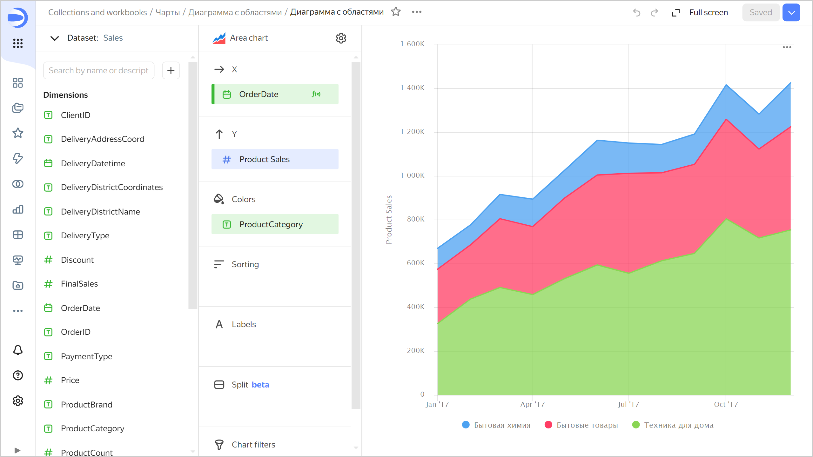
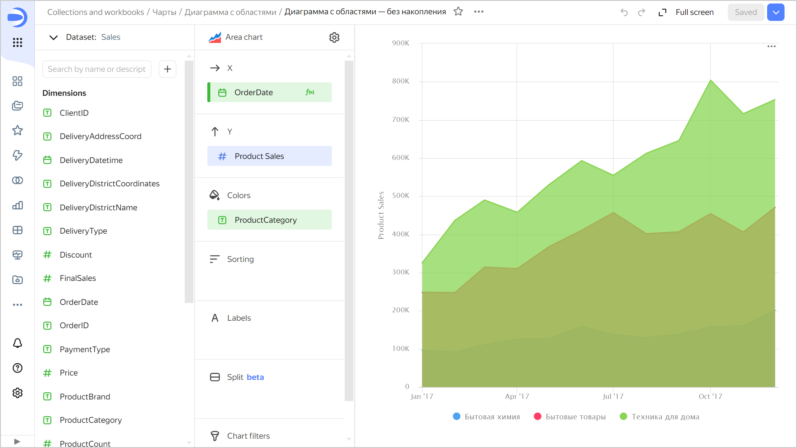
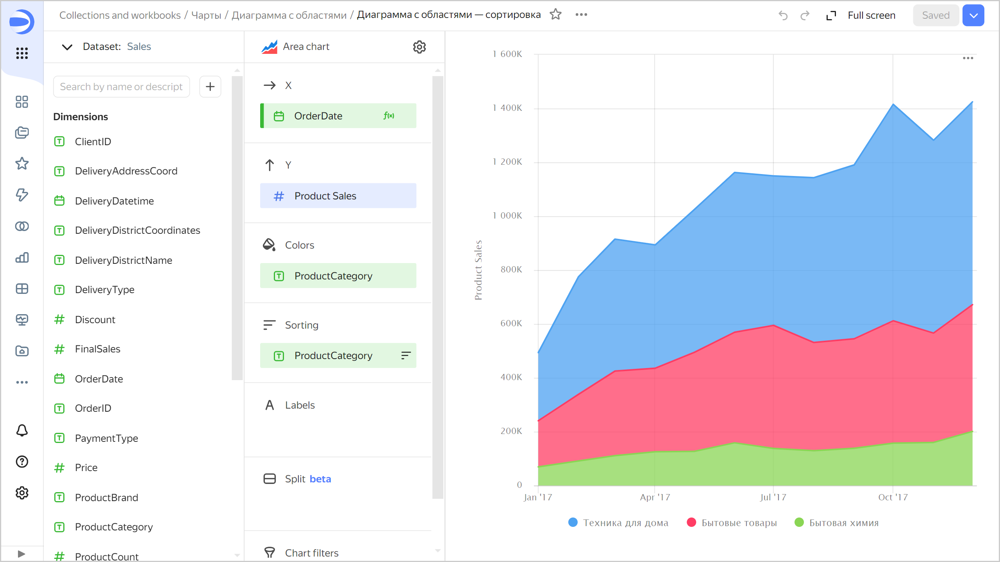
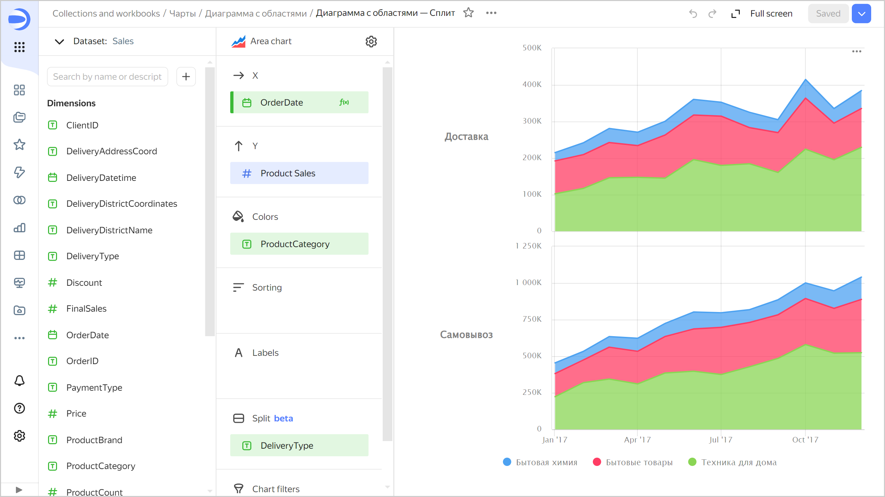

# Area chart 

This chart shows how a measure changed over time. The area between the axis and the line is filled with colors, which shows the volume. Multiple data categories can be stacked one on top of the other or overlap, depending on the [setup](#stacking).



Year |	Home appliances |	Household goods  | Household cleaners
----- | ---------| ---------- | ---------- 
January 2017 |	325K |	248K | 96K
February 2017 |	437K |	247K | 91K
March 2017 |	490K |	314K | 111K
April 2017 |	458K | 310K | 125K
May 2017 |	530K |	368K | 127K
June 2017 |	593K |	411K | 158K
July 2017 |	555K |	457K | 138K
August 2017 |	612K |	402K | 129K
September 2017 |	646K |	407K | 138K
October 2017 |	804K |	454K | 157K
November 2017 |	716K |	406K | 160K
December 2017 |	753K |	471K | 201K



Be careful selecting the measures when building your chart. For example, do not add the number of customers to the sales amount, or the purchase amount to the sales amount.

## Wizard sections {#wizard-sections}

Section  section| Description
----- | ----
X | Dimension. You can specify only one field here. This dimension is usually a date. If this is the case, make sure to specify the `Date` data type for this field in the dataset. This is required for correct sorting and signature display. For better visualization, you can group dates into weeks, months, and years. For more information, see [{#T}](../concepts/chart/settings.md#field-settings).
Y | Measure. You can specify multiple measures. If you add more than one measure to a section, the **Colors** section will contain a dimension named [Measure Names](../concepts/chart/measure-values.md).
Colors | [Measure Names](../concepts/chart/measure-values.md) dimension or field. Affects the color of lines. To remove [Measure Names](../concepts/chart/measure-values.md), delete measures from the Y axis.
Sorting | Dimension or measure. You can use a dimension from the **X** and **Color** sections or a measure from the Y axis. This section affects the sorting of values on the X axis or areas along the Y axis. The sorting direction is marked with an icon next to the field:  for ascending or  for descending. To change the sorting direction, click the icon.
Labels | Measure. Displays measure values on the chart. If multiple measures are added to the **Y** section, drag [Measure Values](../concepts/chart/measure-values.md) to this section. [Markup functions](../function-ref/markup-functions.md) are supported. For `String` type fields, you can configure using basic [{#T}](../dashboard/markdown.md) syntax: click the icon before the field name and enable **Markdown**.
Split | Dimension. Splits a chart horizontally by the selected dimension's values. The maximum number of splits per chart is 25.
Filters | Dimension or measure. Used as a filter.

## Creating an area chart {#create-diagram}

To create an area chart:



1. Go to the {{ datalens-short-name }} home page.
1. In the left-hand panel, select  **Charts**.
1. Click **Create chart** → **Chart**.
1. At the top left, click  **Select dataset** and specify the dataset to visualize.
1. Select **Area chart** as the chart type.
1. Drag a dimension from the dataset to the **X** section. The values will be displayed in the lower part of the chart on the X axis.
1. Drag one or more measures from the dataset to the **Y** section. The values will be displayed as areas along the Y axis.

### Configuring display of `null` values {#null-settings}



### Configuring a stacked chart {#stacking}

Use the **Stacking** option in the [chart settings](../concepts/chart/settings.md#common-settings) to toggle between stacked or unstacked chart display.

A stacked chart shows a ratio of measures by category to the total value. Use this chart type when you need to see how each measure contributes to the total. For example, you can get the breakdown of total sales by product category. If you have multiple data categories, the areas are stacked one on top of the other. The top line represents all data.

An unstacked chart shows the changes in a measure separately for each category. You can use this chart type when you need to compare measures by categories, e.g., total sales in each product category. If you have multiple data categories, the areas overlap. Each line corresponds to measure values for an individual category.

## Recommendations {#recomendations}

* 
* Do not display more than three to five areas on the chart.
* To make it easier to track the dynamics, place the largest or most important categories closer to the chart base. To do this, drag the measure to the **Sorting** section or set up their order in the **Y** section. For example, you can do so to track sales dynamics in the `Household cleaners` category.
  
  
  
  

  

* You can split a chart by dimension into a number of small charts that are convenient to compare to one another. To do this, drag a dimension from the dataset to the **Split** section.

  

  

  

#### See also {#see-also}

* [{#T}](../operations/dashboard/create.md)
* [{#T}](../operations/dashboard/add-chart.md)
* [{#T}](../operations/dashboard/add-selector.md)