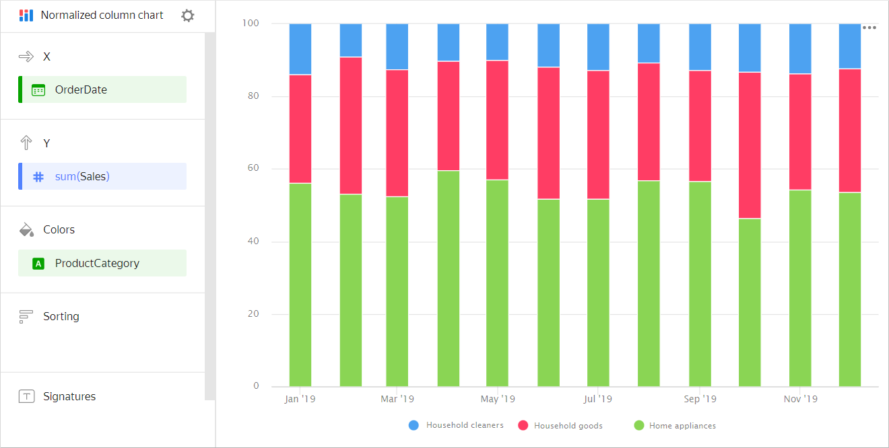

# Normalized column chart 

A normalized column chart shows the contribution of each measure or category to the total amount. Unlike a [stacked column chart](column-chart.md#stacked), the proportion of segment ratios and not the total column length is important for this type of chart. Segments are highlighted in different colors and located one above the other. The height of a segment indicates its ratio to the total amount represented as 100%. For example, the percentage of sales for different product categories.



Month |	Home appliances |	Household goods  | Household cleaners
----- | ---------| ---------- | ---------- 
January 2019|	128K |	55K | 26K
February 2019|	97K |	79K | 18K
March 2019|	187K |	105K | 41K
April 2019|	188K | 137K | 34K
May 2019|	230K |	121K | 43K
June 2019|	256K |	162K | 59K
July 2019|	284K |	206K | 67K
August 2019|	409K |	204K | 72K
September 2019|	314K |	209K | 86K
October 2019|	324K |	262K | 79K
November 2019|	385K |	238K | 101K
December 2019|	451K |	307K | 111K



This type of chart is used to see the contribution of each measure to the total value by period or category. For example, to view the percentage of different expenses in the total budget amount.



Month |	Gasoline | Rent  | Food | Utility bills
----- | ---------| ---------- | ---------- | ---------- 
January 2019	| 100	| 600	| 300	| 500
February 2019	| 150	| 600	| 250	| 700
March 2019	| 100	| 600	| 450	| 400
April 2019	| 120	| 600	| 370	| 510
May 2019	| 100	| 600	| 300	| 530
June 2019	| 130	| 600	| 310	| 600
July 2019	| 150	| 600	| 330	| 510
August 2019	| 120	| 600	| 250	| 550
September 2019	| 110	| 650	| 380	| 500
October 2019	| 120	| 650	| 300	| 550
November 2019	| 130	| 650	| 310	| 540
December 2019	| 100	| 650	| 400	| 550



## Wizard sections {#wizard-sections}

Section  section| Description
----- | ----
X | Dimensions. You can specify one or two dimensions.
Y | Measure. You can specify multiple measures. If you add more than one measure to a section, the **Colors** section will contain a dimension named [Measure Names](../concepts/chart/measure-values.md). [Measure Names](../concepts/chart/measure-values.md) can be moved to the X-axis.
Colors | [Measure Names](../concepts/chart/measure-values.md) dimension or field. Affects the color of lines. To remove [Measure Names](../concepts/chart/measure-values.md), delete measures from the Y axis.
Sorting | Dimension or measure. Affects the column sorting. The sorting direction is marked with an icon next to the field:  for ascending or  for descending. To change the sorting direction, click the icon.
Labels | Measure. Displays measure values on the chart. If multiple measures are added to the **Y** section, drag [Measure Values](../concepts/chart/measure-values.md) to this section. [Markup functions](../function-ref/markup-functions.md) are supported. For `String` type fields, you can configure using basic [{#T}](../dashboard/markdown.md) syntax: click the icon before the field name and enable **Markdown**.
Split | Dimension. Splits a chart horizontally by the selected dimension's values. The maximum number of splits per chart is 25.
Filters | Dimension or measure. Used as a filter.

## Creating a normalized column chart {#create-diagram}

To create a normalized column chart:



1. Go to the {{ datalens-short-name }} home page.
1. In the left-hand panel, select  **Charts**.
1. Click **Create chart** → **Chart**.
1. At the top left, click  **Select dataset** and specify the dataset to visualize.
1. Select **Normalized column chart** as the chart type.
1. Drag a dimension from the dataset to the **X** section. The values will be displayed in the lower part of the chart on the X axis.
1. Drag one or more measures from the dataset to the **Y** section. The values will be displayed as columns on the Y-axis.
1. Drag a dimension from the dataset to the **Color** section. Columns are grouped into segments.

## Recommendations {#recomendations}

* 
* Do not display more than three to five segments on the chart.
* Place segments so that the largest or most important categories are located closer to the chart base. This makes it easier to compare the values.
* You can split a chart by dimension into a number of small charts that are convenient to compare to one another. To do this, drag a dimension from the dataset to the **Split** section.

  

  

  

* To display the absolute values of variables, use a [column chart](column-chart.md).

#### See also {#see-also}

* [{#T}](../operations/dashboard/create.md)
* [{#T}](../operations/dashboard/add-chart.md)
* [{#T}](../operations/dashboard/add-selector.md)