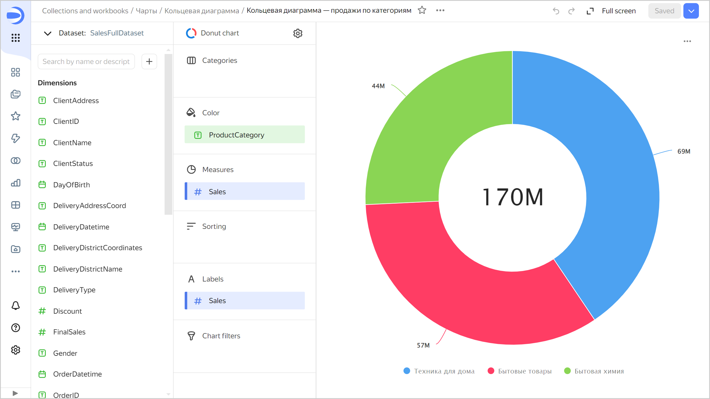
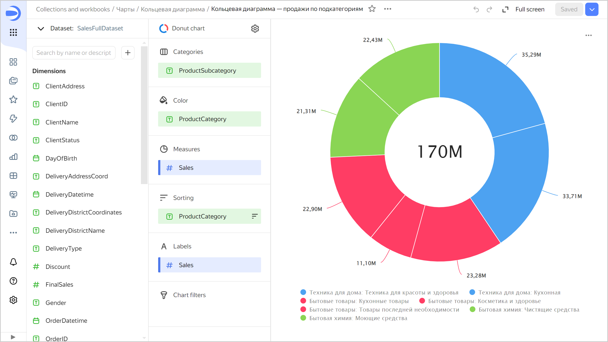

# Donut chart 

This chart shows the proportion of different categories using ring segments. The sum of all segments is 100%. The size of each segment matches the percentage of a category in the total amount. A number in the center of a ring depends on the selected measure and indicates the overall total. Donut charts are a good choice if you need to display a small number of segments.



Product categories | Sales |	
-----|---------| 
Home appliances | 69M |
Household goods | 57M |
Household cleaners | 44M |



You can highlight multiple small segments belonging to a larger category with the same color.

## Wizard sections {#wizard-sections}

Wizard  section| Description
----- | ----
Categories | Dimension. You can specify only one field here. Your data will be grouped by this field.
Color | Dimension. You can specify only one field here. Your charts segments will be colored according to it.
Measures | Affects the size of ring segments. You can only specify one field here. The total value of a measure is displayed in the center of a ring. Calculations using [LOD expressions](../concepts/lod-aggregation.md), [window functions](../function-ref/window-functions.md), and [time series functions](../function-ref/time-series-functions.md) are not presented in the total value.
Sorting | Measure or dimension from the **Color** section. Affects segment sorting. The sorting direction is marked with an icon next to the field:  for ascending or  for descending. To change the sorting direction, click the icon.
Labels | Measure. Displays measure values on the chart. To add callouts with category names to the chart, drag the [Measure Names](../concepts/chart/measure-values.md) dimension to this section. [Markup functions](../function-ref/markup-functions.md) are supported. For `String` type fields, you can configure using basic [{#T}](../dashboard/markdown.md) syntax: click the icon before the field name and enable **Markdown**.
Filters | Dimension or measure. Used as a filter.

## Creating a donut chart {#create-diagram}

To create a donut chart:



1. Go to the {{ datalens-short-name }} home page.
1. In the left-hand panel, select  **Charts**.
1. Click **Create chart** → **Chart**.
1. At the top left, click  **Select dataset** and specify the dataset to visualize.
1. Select **Donut chart** as the chart type.
1. Drag a dimension from the dataset to the **Categories** section.
1. Drag a dimension or measure from the dataset to the **Color** section.
1. Drag a measure from the dataset to the **Measures** section. The values will be displayed as donut chart segments.

To disable displaying a number in the center:

1. In the top-left part of the screen, click .
1. In the **Chart settings** window, disable the **Results** option.
1. Click **Apply**.

## Recommendations {#recommendations}

* If there are more than 4-6 segments per chart, group the smallest of them as **Other**. A larger number of segments overloads a chart and makes it difficult to understand the data.
* Combine small segments into larger groups:
  
  * Use the **Categories** section to highlight segments.
  * Use the **Color** section to highlight groups.

* You cannot display negative and null values on this type of chart.
* Do not use donut charts to show changes to proportions over time or for precisely comparing data by category.

#### See also {#see-also}

* [{#T}](../operations/dashboard/create.md)
* [{#T}](../operations/dashboard/add-chart.md)
* [{#T}](../operations/dashboard/add-selector.md)