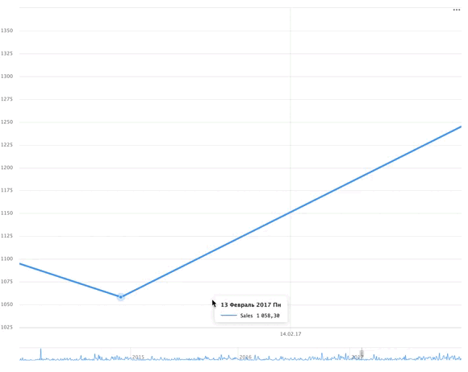

# Настройка навигатора



Навигатор доступен для чартов из списка, у которых в секции **X** находится поле с типом `Дата` или `Дата и время`:
 
* [Линейная диаграмма](../../visualization-ref/line-chart.md)
* [Накопительная диаграмма с областями](../../visualization-ref/area-chart.md)
* [Нормированная диаграмма с областями](../../visualization-ref/normalized-area-chart.md)
* [Столбчатая диаграмма](../../visualization-ref/column-chart.md)



Чтобы настроить навигатор:

1. На панели слева нажмите  **Чарты** и выберите чарт, у которого необходимо настроить навигатор.
1. В левой части экрана над чартом нажмите значок .
1. В окне **Настройки чарта** включите опцию **Навигатор**.
1. Выберите режим отображения навигатора:

   * **Все линии** — для отображения в навигаторе всех линий, которые есть в чарте.
   * **Выбрать линии** — для отображения в навигаторе выбранных линий.

1. Укажите **Период по умолчанию**. При каждом открытии чарта будет отображаться последний период, соответствующий данной настройке. Укажите значение `0` или оставьте поле пустым для отображения всего диапазона значений.
1. Нажмите **Применить**. Навигатор отобразится внизу чарта.



   .



