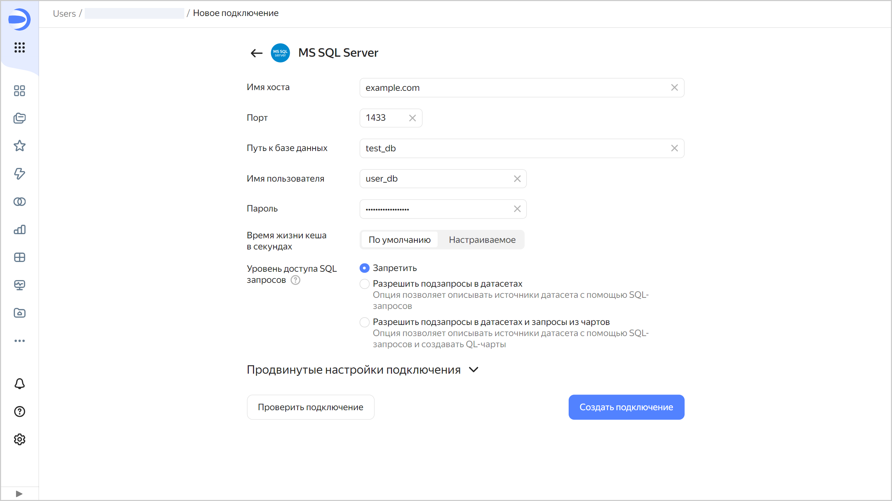

# Создание подключения к {{ MS }}

Чтобы создать подключение к {{ MS }}:

1. Перейдите на страницу [воркбука](../../workbooks-collections/index.md) или создайте новый.
1. В правом верхнем углу нажмите **Создать** → **Подключение**.
1. Выберите подключение **MS SQL Server**.
1. Укажите параметры подключения для внешней БД **MS SQL Server**:

   * **Имя хоста**. Укажите путь до хоста-мастера или IP-адрес хоста-мастера {{ MS }}. Вы можете указать несколько хостов через запятую. Если к первому хосту подключиться не получится, {{ datalens-short-name }} выберет следующий из списка.
   * **Порт**. Укажите порт подключения к {{ MS }}. Порт по умолчанию — 1433.
   * **Путь к базе данных**. Укажите имя подключаемой базы данных.
   * **Имя пользователя**. Укажите имя пользователя для подключения к {{ MS }}.
   * **Пароль**. Укажите пароль для указанного пользователя.
   * **Время жизни кеша в секундах**. Укажите время жизни кеша или оставьте значение по умолчанию. Рекомендованное значение — 300 секунд (5 минут).

   
   * **Уровень доступа SQL запросов**. Позволяет использовать произвольный SQL-запрос для [формирования датасета](../../dataset/settings.md#sql-request-in-datatset).

   

1. (опционально) Проверьте работоспособность подключения. Для этого нажмите кнопку **Проверить подключение**.
1. Нажмите кнопку **Создать подключение**.

1. Выберите [воркбук](../../workbooks-collections/index.md), в котором сохранится подключение, или создайте новый. Если вы пользуетесь старой навигацией по папкам, выберите папку для сохранения подключения. Нажмите кнопку **Создать**.

1. Укажите название подключения и нажмите кнопку **Создать**.

## Дополнительные настройки {#additional-settings}


