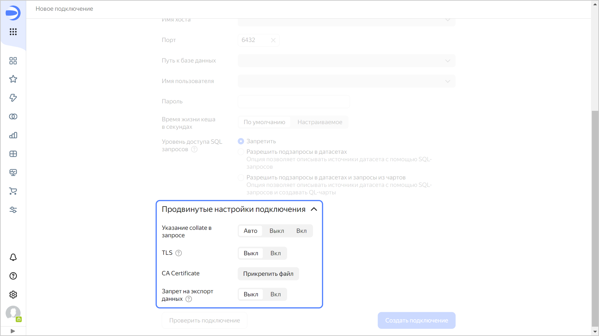

# Создание подключения к {{ PG }} в {{ datalens-full-name }}

Чтобы создать подключение к {{ PG }}:

1. Перейдите на страницу [воркбука](../../workbooks-collections/index.md) или создайте новый.
1. В правом верхнем углу нажмите **Создать** → **Подключение**.
1. Выберите подключение **{{ PG }}**.
1. Укажите параметры подключения для внешней БД {{ PG }}:

   

1. (опционально) Проверьте работоспособность подключения. Для этого нажмите кнопку **Проверить подключение**.
1. Нажмите кнопку **Создать подключение**.
1. Укажите название подключения и нажмите кнопку **Создать**.

## Дополнительные настройки {#postgresql-additional-settings}

Вы можете указать дополнительные параметры подключения в разделе **Продвинутые настройки подключения**:

* **Указание collate в запросе** — если в запросах к БД требуется явно задать правило сортировки, выберите один из режимов:

  * **Авто** — применяется настройка по умолчанию, решение о включении локали `en_US` остается на усмотрение {{ datalens-short-name }}.
  * **Вкл** — применяется настройка {{ datalens-short-name }}, для отдельных выражений в запросе указывается локаль `en_US`. Это приводит к использованию соответствующей логики сортировки сервером, вне зависимости от настроек сервера и конкретных таблиц. Используйте настройку {{ datalens-short-name }}, если локаль в БД несовместима с работой {{ datalens-short-name }}. 
  * **Выкл** — применяется настройка по умолчанию, {{ datalens-short-name }} использует только имеющиеся параметры локали БД.

* **TLS** — опция определяет необходимость использования протокола TLS. Когда опция включена, параметр `sslmode` принимает значение `required`, когда выключена — `prefer`.
* **CA Certificate** — чтобы загрузить сертификат, нажмите кнопку **Прикрепить файл** и укажите файл сертификата. Когда сертификат загружен, поле отображает название файла.
* 

