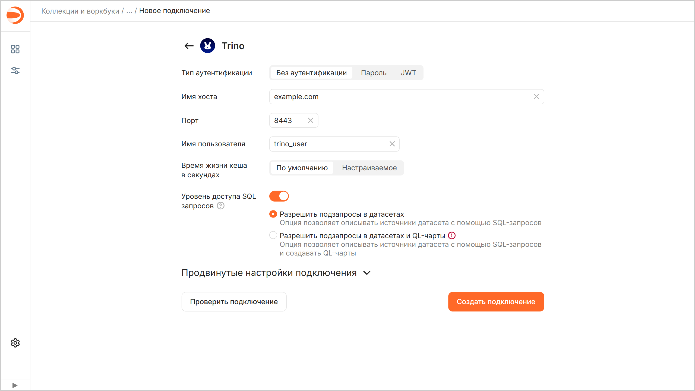
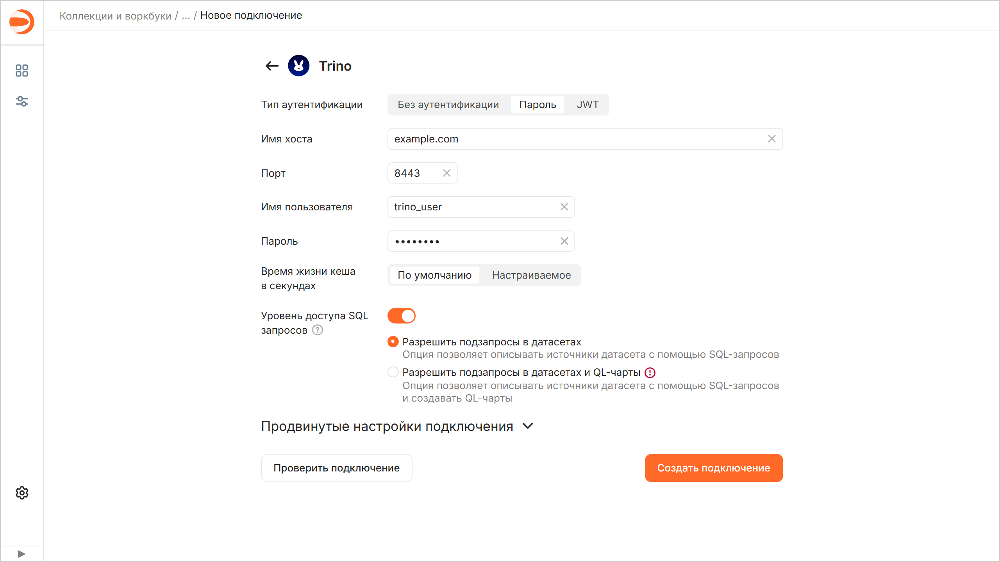
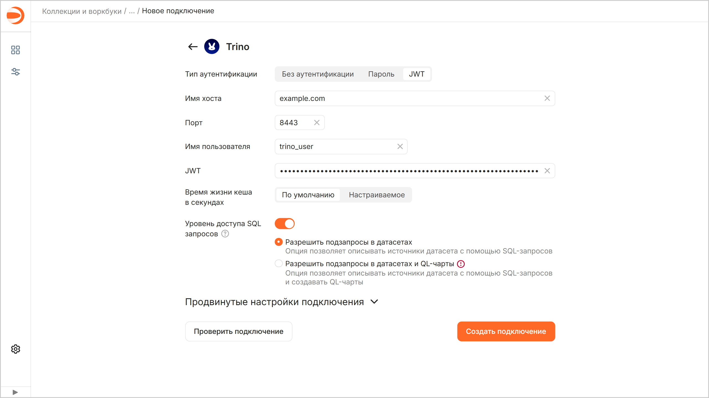
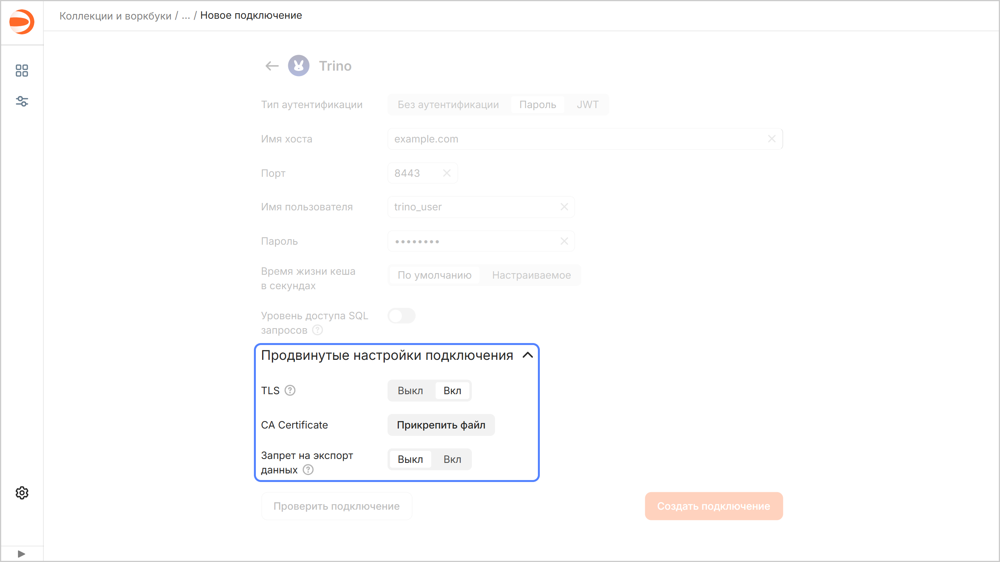

# Создание подключения к {{ TR }} в {{ datalens-full-name }}

Чтобы создать подключение к {{ TR }}:

1. Перейдите на страницу [воркбука](../../workbooks-collections/index.md) или создайте новый.
1. В правом верхнем углу нажмите **Создать** → **Подключение**.
1. Выберите подключение **{{ TR }}**.
1. Выберите режим аутентификации и укажите параметры подключения:

   

   - Без аутентификации {#noauth}

     * **Имя хоста**. Укажите путь до координатора или IP-адрес координатора {{ TR }}.
     * **Порт**. Укажите порт подключения к {{ TR }}. Порт по умолчанию — 8443.
     * **Имя пользователя**. Укажите имя пользователя для подключения к {{ TR }}. (Если аутентификация отключена, имя пользователя может быть любым, на подключение это не влияет. Значение поля будет отправляться с запросами к источнику.)
     * **Время жизни кеша в секундах**. Укажите время жизни кеша или оставьте значение по умолчанию. Рекомендованное значение — 300 секунд (5 минут).

     

     

   - Пароль {#password}

     * **Имя хоста**. Укажите путь до координатора или IP-адрес координатора {{ TR }}.
     * **Порт**. Укажите порт подключения к {{ TR }}. Порт по умолчанию — 8443.
     * **Имя пользователя**. Укажите имя пользователя для подключения к {{ TR }}.
     * **Пароль**. Укажите пароль для указанного пользователя.
     * **Время жизни кеша в секундах**. Укажите время жизни кеша или оставьте значение по умолчанию. Рекомендованное значение — 300 секунд (5 минут).

     

     

   - JWT {#jwt}

     * **Имя хоста**. Укажите путь до координатора или IP-адрес координатора {{ TR }}.
     * **Порт**. Укажите порт подключения к {{ TR }}. Порт по умолчанию — 8443.
     * **Имя пользователя**. Укажите имя пользователя для подключения к {{ TR }}.
     * **JWT**. Укажите JWT-токен.
     * **Время жизни кеша в секундах**. Укажите время жизни кеша или оставьте значение по умолчанию. Рекомендованное значение — 300 секунд (5 минут).

     

     

   

1. (опционально) Проверьте работоспособность подключения. Для этого нажмите кнопку **Проверить подключение**.
1. Нажмите кнопку **Создать подключение**.
1. Укажите название подключения и нажмите кнопку **Создать**.

## Дополнительные настройки {#additional-settings}

Вы можете указать дополнительные параметры подключения в разделе **Продвинутые настройки подключения**:

* **TLS** — когда опция включена, при взаимодействии с {{ TR }} используется протокол `HTTPS`, когда выключена — `HTTP`.
* **CA Certificate** — чтобы загрузить сертификат, нажмите кнопку **Прикрепить файл** и укажите файл сертификата. Когда сертификат загружен, поле отображает название файла.
* 
* 



На данный момент для {{ TR }} не реализована функция [UNNEST](../../../datalens/function-ref/UNNEST.md).



