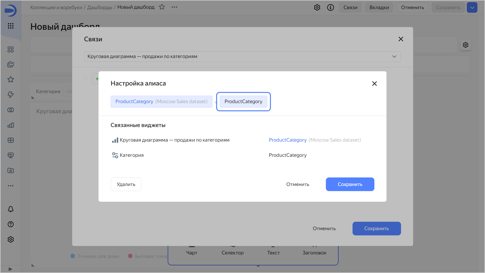
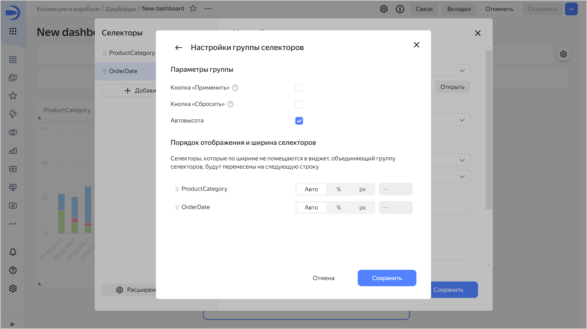

# Добавление селектора на дашборд

Чтобы добавить [селектор](../../dashboard/selector.md) на дашборд:

1. На панели слева нажмите  **Дашборды** и выберите нужный дашборд.
1. В верхней части страницы нажмите кнопку **Редактировать**.
1. На панели в нижней части страницы зажмите   **Селектор** и перетащите его в нужную область.

   
   

1. В блоке **Настройки селектора** выберите источник и укажите настройки селектора:

   

   - На основе датасета

     * **Датасет** — датасет с данными для селектора. Можно выбрать датасет из списка объектов или указать ссылку. Обязательно для заполнения.
     * **Поле** — поле датасета со значениями селектора. Может быть как измерением, так и показателем (подробнее см. [{#T}](../../dataset/data-model.md#field)). Обязательно для заполнения.
     * **Тип селектора** — выпадающий список, поле ввода, календарь или чекбокс.

       

       * **Календарь** доступен только для полей с типом `Дата` или `Дата и время`.
       * **Чекбокс** доступен только для полей с типом `Логический`.
       * Для показателей доступен только тип селектора **Поле ввода**.

       

     * **Операция** — операция сравнения, по которой селектор фильтрует значения чарта (например, **Равно**, **Больше** или **Меньше**). Если оставить поле пустым, селектор по умолчанию будет фильтровать по операции **Равно**. Список доступных операций зависит от типа поля.
       
       
       
       Не указывайте операцию, если селектор:

       * будет фильтровать QL-чарт;
       * связан с параметрами чарта или датасета.

       

     * **Множественный выбор** — опция позволяет выбирать несколько значений в селекторе. Доступно только для селекторов типа **Список**.
     * **Диапазон** — опция позволяет выбирать временной промежуток в селекторе. Доступно только для селекторов типа **Календарь**.
     * **Обязательное поле** — делает значение селектора обязательным для заполнения. При включенной опции в конце названия селектора добавляется `*`. Недоступно для селектора типа **Чекбокс**.
     * **Значение по умолчанию** — отображается изначально при открытии дашборда. Обязательно для заполнения при включенной опции **Обязательное поле**.

     * **Заголовок** — используется для выбора селектора при установлении связи с другими виджетами. По умолчанию при добавлении селектора текст названия подставляется из названия поля в [датасете](../../dataset/index.md). Обязательно для заполнения.
       
       Ниже выберите расположение заголовка: `Слева` (по умолчанию), `Сверху` или `Скрыт`, чтобы не отображать его на дашборде. Недоступно в селекторах типа **Чекбокс**.

     * **Внутренний заголовок** — позволяет указать текст внутри селектора. Например, его можно использовать для отображения операции внутри селектора. Недоступен в селекторах типа **Чекбокс**.
     * **Цветовой акцент** — опция позволяет выделить цветом важные селекторы. Недоступно в селекторах типа **Чекбокс**.
     * **Подсказка** — опция позволяет добавить текстовое пояснение к селектору. По умолчанию при включении опции текст пояснения подставляется из описания поля в датасете. Вы можете изменить текст подсказки и использовать для этого визуальный редактор или разметку [Markdown](../../dashboard/markdown.md). При изменении описания поля в датасете текст не обновляется автоматически.

       Когда опция включена, на дашборде рядом с селектором появляется значок . При наведении курсора на значок отображается всплывающая подсказка.

   - Ручной ввод

     * **Поле или параметр** — имя поля, по которому можно установить связь селектора с другими виджетами в окне настройки [алиаса](../../dashboard/link.md#alias). Обязательно для заполнения.

       

     * **Тип селектора** — выпадающий список, поле ввода, календарь или чекбокс.

       

       * **Календарь** доступен только для полей с типом `Дата` или `Дата и время`.
       * **Чекбокс** доступен только для полей с типом `Логический`.
       * Для показателей доступен только тип селектора **Поле ввода**.

       

     * **Операция** — операция сравнения, по которой селектор фильтрует значения чарта (например, **Равно**, **Больше** или **Меньше**). Если оставить поле пустым, селектор по умолчанию будет фильтровать по операции **Равно**. Список доступных операций зависит от типа поля.
       
       
       
       Не указывайте операцию, если селектор:

       * будет фильтровать QL-чарт;
       * связан с параметрами чарта или датасета.

       

     * **Обязательное поле** — делает значение селектора обязательным для заполнения. При включенной опции в конце названия селектора добавляется `*`. Недоступно для селектора типа **Чекбокс**.
     * **Множественный выбор** — опция позволяет выбирать несколько значений в селекторе. Доступно только для селекторов типа **Список**.
     * **Возможные значения** — список значений для выбора. Доступно только для селекторов типа **Список**. Чтобы добавить сразу несколько значений, скопируйте список значений в буфер, вставьте его в поле ввода и нажмите кнопку **Добавить**. Вы также можете удалить значение, нажав , или поменять значения местами, перетащив их.
     * **Диапазон** — опция позволяет выбирать временной промежуток в селекторе. Доступно только для селекторов типа **Календарь**.
     * **Время** — опция позволяет указывать время. Доступно только для селекторов типа **Календарь**.
     * **Значение по умолчанию** — отображается изначально при открытии дашборда. Обязательное поле для селектора типа **Список**: если его не заполнить, в селекторе не будет доступно ни одного значения. Обязательно для заполнения при включенной опции **Обязательное поле**.

     * **Заголовок** — используется для выбора селектора при установлении связи с другими виджетами. Обязательно для заполнения.
       
       Ниже выберите расположение заголовка: `Слева` (по умолчанию), `Сверху` или `Скрыт`, чтобы не отображать его на дашборде. Недоступно в селекторах типа **Чекбокс**.

     * **Внутренний заголовок** — позволяет указать текст внутри селектора. Например, его можно использовать для отображения операции внутри селектора. Недоступен в селекторах типа **Чекбокс**.
     * **Цветовой акцент** — опция позволяет выделить цветом важные селекторы. Недоступно в селекторах типа **Чекбокс**.
     * **Подсказка** — опция позволяет добавить текстовое пояснение к селектору. По умолчанию при включении опции текст пояснения подставляется из описания поля в [датасете](../../dataset/index.md). Вы можете изменить текст подсказки. При изменении описания поля в датасете текст не обновляется автоматически.

       Когда опция включена, на дашборде рядом с селектором появляется значок . При наведении курсора на значок отображается всплывающая подсказка.

   

   Для [QL-чартов](../../concepts/chart/ql-charts.md) в области редактирования чарта на вкладке **Параметры** можно управлять [параметрами селектора](../chart/create-sql-chart.md#selector-parameters), а на вкладке **Запрос** указывать переменную в самом запросе в `not_var{{variable}}` формате.

1. (опционально) Добавьте еще один селектор в виджет. Для этого слева в блоке **Селекторы** нажмите кнопку  **Добавить селектор** и повторите действия из предыдущего шага. Также вы можете продублировать созданный селектор или скопировать его в буфер обмена. Для этого в блоке **Селекторы** напротив селектора нажмите значок  и выберите:

   * **Дублировать** — в виджет добавится новый селектор с такими же параметрами;
   * **Скопировать в буфер** — вы можете вставить скопированный селектор в другой виджет с помощью кнопки **Вставить** в блоке **Селекторы** или на дашборд с помощью кнопки **Вставка** на панели в нижней части страницы дашборда.

1. (опционально) Нажмите  **Расширенные настройки** и укажите настройки виджета:

   * **Кнопка «Применить»** — добавляет для виджета кнопку, которая применяет значения всех селекторов в виджете. До нажатия кнопки значения селекторов не применяются.
   * **Кнопка «Сбросить»** — добавляет для виджета кнопку, которая сбрасывает значения всех селекторов в виджете до значений по умолчанию.
   * **Автовысота** — включает автоматическую высоту для виджета на дашборде. Доступно для виджета с несколькими селекторами.
   * **Автообновление зависимых селекторов** — позволяет включить для зависимых селекторов влияние друг на друга до нажатия кнопки **Применить**. Доступно для виджета с несколькими селекторами и включенной опцией **Кнопка «Применить»**.
   * (опционально) Для виджета с несколькими селекторами настройте расположение селекторов. Для этого расположите селекторы в нужном порядке, перетаскивая их, и настройте ширину для каждого селектора:

      * `Авто` — автоматическая ширина селектора;
      * `%` — ширина селектора в процентах от общей ширины виджета;
      * `px` — ширина селектора в пикселях.

   Нажмите **Сохранить**.

   

1. Нажмите кнопку **Сохранить**. Виджет отобразится на дашборде.



При добавлении селектора по полю на дашборд фильтры, добавленные на уровне чарта, перестают применяться к графику на дашборде.



## Ограничения {#restrictions}

* Для селекторов по показателям доступен только один тип — **Поле ввода**.
* Селекторы по показателям рекомендуется делать только независимыми от других селекторов. Для этого задайте для них тип [связи](../../dashboard/link.md) **Не связаны** с другими селекторами в разделе **Связи** при редактировании дашборда.
