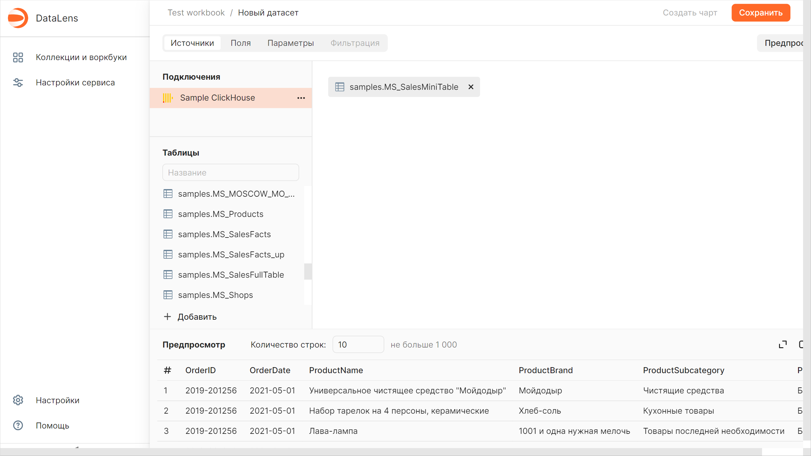
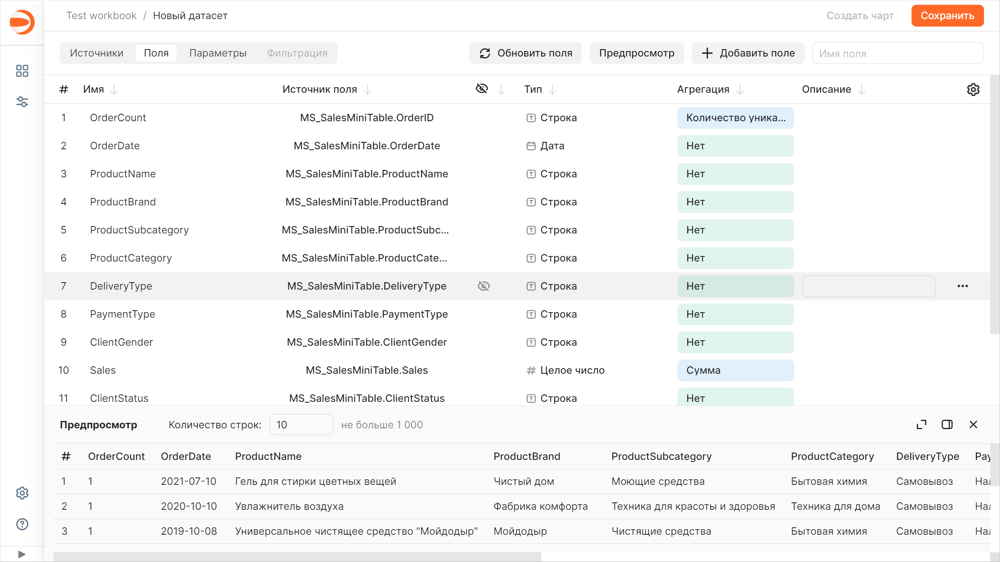
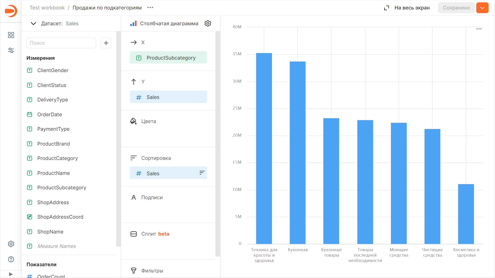
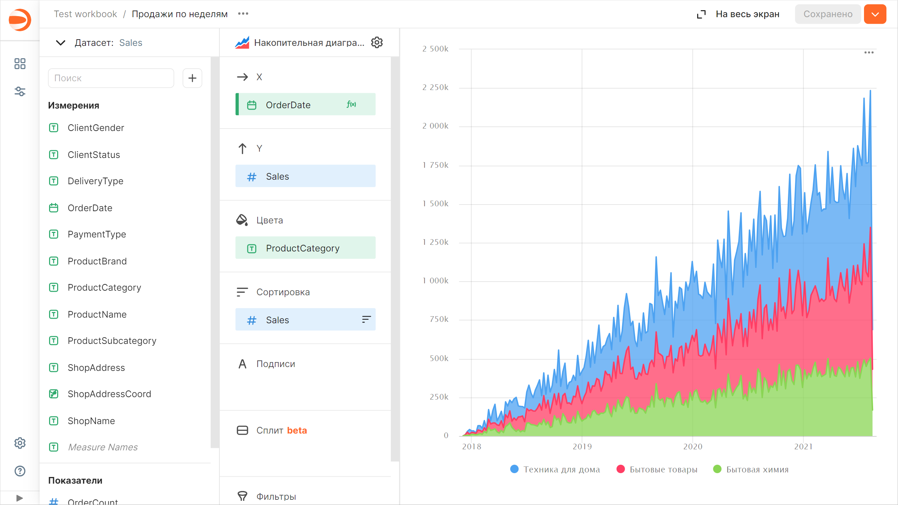
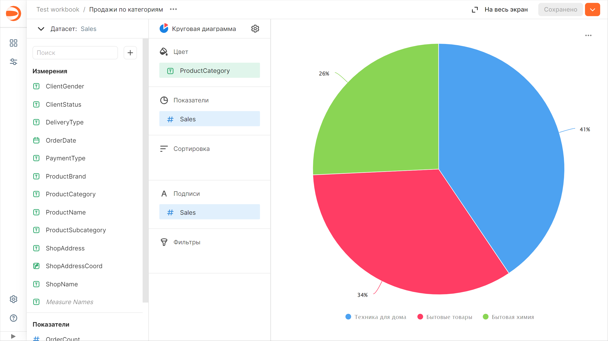
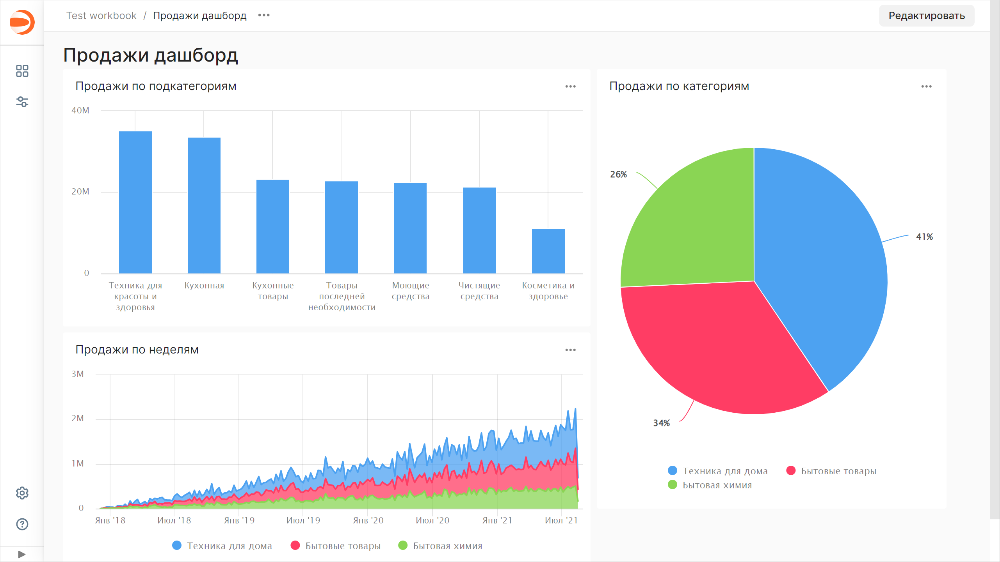
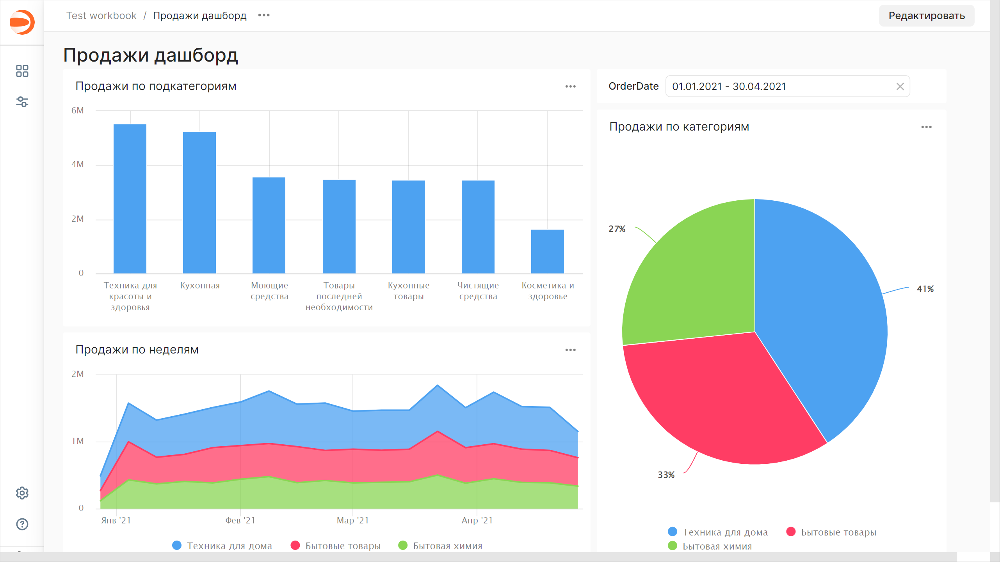

# Как начать работать с {{ datalens-short-name }}


В этой инструкции вы развернете {{ datalens-short-name }} локально, создадите свой первый [датасет](concepts/dataset/index.md), для визуализации данных построите несколько [чартов](concepts/chart/index.md) и разместите их на [дашборде](concepts/dashboard.md).

## Разверните {{ datalens-short-name }} {#create-datalens}

Чтобы развернуть {{ datalens-short-name }} локально, достаточно запустить несколько контейнеров через [Docker Compose](https://docs.docker.com/compose/):

1. Если у вас нет Docker, установите его по инструкции для вашей платформы:

   * [macOS](https://docs.docker.com/desktop/install/mac-install/)
   * [Linux](https://docs.docker.com/engine/install/)
   * [Windows](https://docs.docker.com/desktop/install/windows-install/)

1. Выполните следующие команды:

   ```bash
   git clone https://github.com/datalens-tech/datalens
   cd datalens
   HC=1 docker compose up
   ```

   Последняя команда запустит все контейнеры, необходимые для старта {{ datalens-short-name }}. Можете выполнить ее с параметром для подключения внешней базы данных:

   ```bash
   METADATA_POSTGRES_DSN_LIST="postgres://{user}:{password}@{host}:{port}/{database}" HC=1 docker compose up
   ```

   

   [Highcharts](https://github.com/highcharts/highcharts/blob/master/readme.md) — это запатентованный коммерческий продукт. Если вы включаете Highcharts в своем экземпляре {{ datalens-short-name }} (с переменной `HC=1`), вы должны соблюдать [лицензию](https://github.com/highcharts/highcharts/blob/master/license.txt).

   

1. Перейдите в пользовательский интерфейс {{ datalens-short-name }} по адресу `http://localhost:8080`.

После запуска {{ datalens-short-name }} вы сможете:

* изучить демо-примеры;
* подключить [источники](concepts/connection.md);
* построить свои [дашборды](concepts/dashboard.md).

В первый релиз открытой версии входит все необходимое, чтобы опробовать возможности {{ datalens-short-name }} на своей инфраструктуре. Сейчас в [репозитории](https://github.com/datalens-tech/datalens/) опубликовано ядро сервиса, набор основных подключений ([{{ PG }}](operations/connection/create-postgresql.md), [{{ CH }}](operations/connection/create-clickhouse.md) и [{{ ytsaurus-name }}](operations/connection/chyt/create-chyt.md)) и основные части интерфейса.

## Создайте воркбук {#create-workbook}

1. Перейдите на главную страницу {{ datalens-short-name }}.
1. На панели слева выберите  **Коллекции и воркбуки**.
1. В правом верхнем углу нажмите **Создать** → **Создать воркбук**.
1. Укажите название воркбука.
1. Нажмите кнопку **Создать**.

## Создайте подключение {#create-connection}



## Создайте датасет {#create-dataset}

1. В правом верхнем углу нажмите кнопку **Создать датасет**.
1. Перенесите на рабочую область таблицу `MS_SalesMiniTable`.

   

1. Перейдите на вкладку **Поля**.
1. В столбце **Агрегация** для поля `Sales` выберите **Сумма**.
1. Создайте показатель с количеством заказов:

   1. Переименуйте поле `OrderID` в `OrderCount`.
   1. Измените тип агрегации на **Количество уникальных**.

1. Для поля `ShopAddressCoord` измените тип данных на **Геоточка**.
1. Сохраните датасет:

   1. В правом верхнем углу нажмите кнопку **Сохранить**.
   1. Введите имя датасета и нажмите кнопку **Создать**.

   

## Создайте чарт — столбчатая диаграмма {#create-column-chart}

1. В правом верхнем углу нажмите кнопку **Создать чарт**.
1. Выберите тип визуализации **Столбчатая диаграмма**.
1. Добавьте на чарт подкатегорию товаров. Для этого из раздела **Измерения** перетащите поле `ProductSubcategory` в секцию **X**.
1. Добавьте на чарт показатель продаж. Для этого из раздела **Показатели** перетащите поле `Sales` в секцию **Y**.
1. Отсортируйте чарт по убыванию по показателю продаж — из раздела **Показатели** перетащите поле `Sales` в секцию **Сортировка**.
1. Сохраните чарт:

   1. В правом верхнем углу нажмите кнопку **Сохранить**.
   1. В открывшемся окне введите название чарта **Продажи по подкатегориям** и нажмите кнопку **Сохранить**.

   

## Создайте чарт — накопительная диаграмма с областями {#create-area-chart}

1. В созданном на предыдущем шаге чарте выберите тип визуализации **Накопительная диаграмма с областями**.
1. Замените подкатегории товаров на дату заказа на оси X. Для этого из раздела **Измерения** перетащите поле `OrderDate` в секцию **X** и наведите его над полем `ProductSubcategory`, пока то не станет красным.
1. Добавьте на чарт категорию товаров. Для этого из раздела **Измерения** перетащите поле `ProductCategory` в секцию **Цвета**.
1. Отобразите чарт по неделям:

   1. В секции **X** нажмите на иконку с календарем у поля `OrderDate`.
   1. В поле **Группировка** выберите **Округление** → **Неделя**.
   1. Нажмите кнопку **Применить**.

1. Сохраните чарт:

   1. В правом верхнем углу нажмите значок  → **Сохранить как копию**.
   1. В открывшемся окне введите название нового чарта **Продажи по неделям** и нажмите кнопку **Сохранить**.

   

## Создайте чарт — круговая диаграмма {#create-pie-chart}

1. В созданном на предыдущем шаге чарте выберите тип визуализации **Круговая диаграмма**.
1. Добавьте на чарт категорию товаров. Для этого из раздела **Измерения** перетащите поле `ProductCategory` в секцию **Цвета**.
1. Добавьте на чарт показатель продаж. Для этого из раздела **Показатели** перетащите поле `Sales` в секцию **Показатели**.
1. Добавьте подпись к показателям:

   1. Из раздела **Показатели** перетащите поле `Sales` в секцию **Подписи**.
   1. Нажмите на значок слева от названия показателя.
   1. В открывшемся окне для настройки **Значение подписи** выберите **В процентах** и нажмите кнопку **Применить**.

1. Сохраните чарт:

   1. В правом верхнем углу нажмите значок  → **Сохранить как копию**.
   1. В открывшемся окне введите название нового чарта **Продажи по категориям** и нажмите кнопку **Сохранить**.

   

## Создайте дашборд {#create-dashboard}

1. Перейдите на страницу воркбука.
1. В правом верхнем углу нажмите **Создать** → **Дашборд**.
1. Введите название дашборда и нажмите кнопку **Создать**.

## Добавьте чарты на дашборд {#add-charts}

1. В правом верхнем углу нажмите кнопку **Добавить** и выберите **Чарт**.
1. Выберите чарт **Продажи по подкатегориям**. После этого автоматически заполнится поле **Название**.
1. Нажмите кнопку **Добавить**.
1. Аналогичным способом добавьте чарты **Продажи по месяцам** и **Продажи по категориям**.
1. Расположите чарты на дашборде в удобном для вас порядке.
1. Сохраните дашборд. Для этого в правом верхнем углу нажмите кнопку **Сохранить**.

   

## Добавьте селектор на дашборд {#add-selectors}

1. В правом верхнем углу нажмите кнопку **Редактировать**.
1. Нажмите кнопку **Добавить** и выберите **Селектор**.
1. Добавьте селектор с календарем по датам заказа:

   1. Выберите созданный датасет.
   1. Выберите поле `OrderDate`. После этого автоматически заполнится поле **Название**.
   1. Включите опцию **Диапазон**.
   1. Нажмите кнопку **Добавить**.

1. Расположите селектор на дашборде в удобном для вас месте.
1. Сохраните дашборд. Для этого в правом верхнем углу нажмите кнопку **Сохранить**.

   


## Что дальше {#whats-next}

* Ознакомьтесь с [концепциями сервиса](./concepts/index.md).
* Посмотрите [пример готового дашборда](https://datalens.yandex/9fms9uae7ip02).
