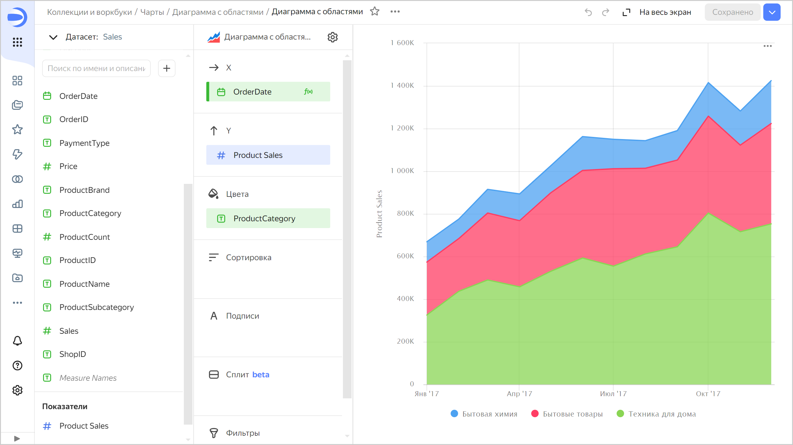
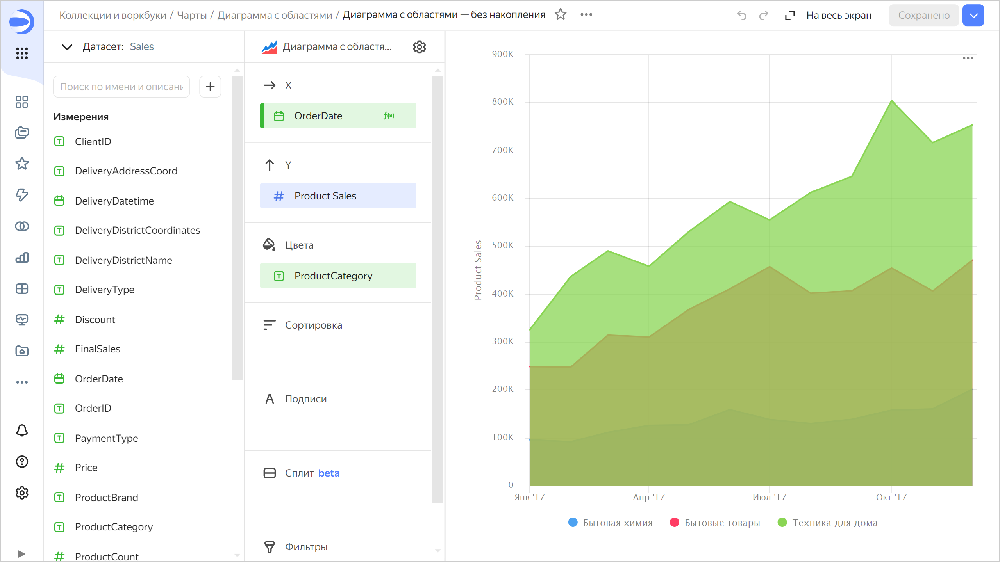
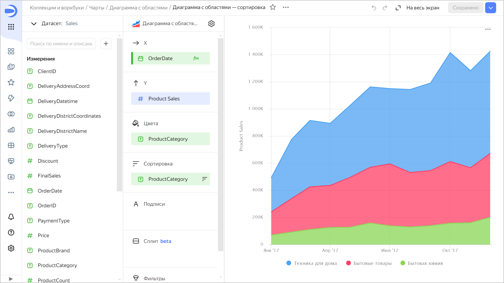
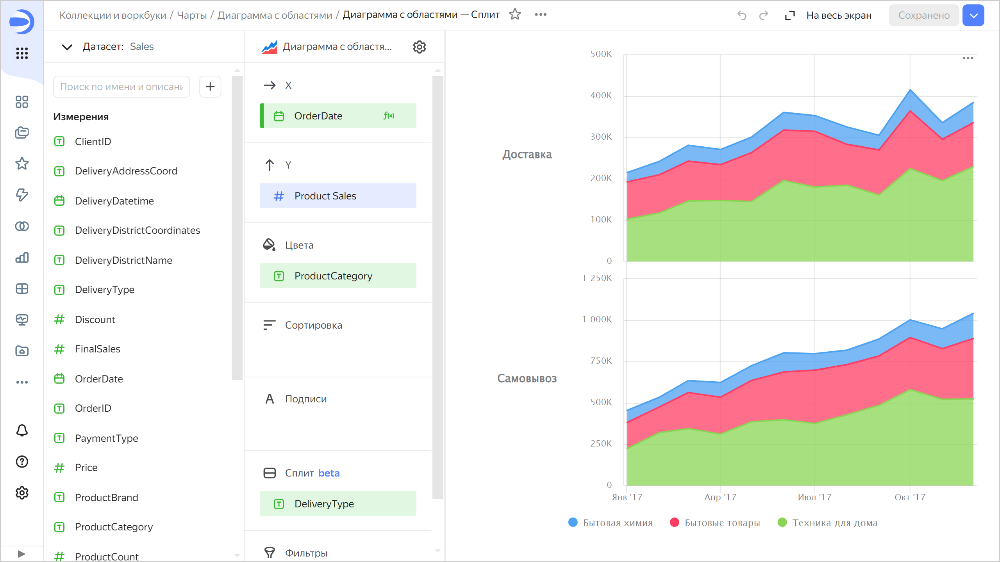

# Диаграмма с областями 

Диаграмма показывает изменение показателя во времени. Область между осью и линией заполняется цветами, чтобы указать объем. При показе нескольких категорий данных, они накладываются друг на друга сверху или в проекции, в зависимости от [настройки](#stacking).



Год |	Техника для дома |	Бытовые товары  | Бытовая химия
----- | ---------| ---------- | ---------- 
Январь 2017 |	325К |	248К | 96К
Февраль 2017 |	437К |	247К | 91К
Март 2017 |	490К |	314К | 111К
Апрель 2017 |	458К | 310К | 125К
Май 2017 |	530К |	368К | 127К
Июнь 2017 |	593К |	411К | 158К
Июль 2017 |	555К |	457К | 138К	
Август 2017 |	612К |	402К | 129К
Сентябрь 2017 |	646К |	407К | 138К
Октябрь 2017 |	804К |	454К | 157К
Ноябрь 2017 |	716К |	406К | 160К
Декабрь 2017 |	753К |	471К | 201К



Внимательно выбирайте показатели для построения диаграммы. Например, некорректно складывать количество клиентов и сумму продаж, или сумму продаж и сумму закупок.

## Секции в визарде {#wizard-sections}

Секция  в визарде| Описание
----- | ----
X | Измерение. Может быть указано только одно поле. Обычно это измерение бывает датой. В этом случае проверьте, что в датасете для этого поля указан тип данных `Дата`. Это необходимо для корректной сортировки, отображения подписей. Для более наглядной визуализации дату можно группировать в недели, месяцы, годы (подробнее в разделе [{#T}](../concepts/chart/settings.md#field-settings)).
Y | Показатель. Может быть указано несколько показателей. При добавлении в секцию более одного показателя в секции **Цвета** появится измерение [Measure Names](../concepts/chart/measure-values.md).
Цвета | Измерение или поле [Measure Names](../concepts/chart/measure-values.md). Влияет на цвет линий. [Measure Names](../concepts/chart/measure-values.md) удаляется путем удаления показателей с оси Y.
Сортировка | Измерение или показатель. Может использоваться измерение из секций **Х** и **Цвета** или показатель с оси Y. Влияет на сортировку оси X или областей по оси Y. Направление сортировки отмечено значком рядом с полем: по возрастанию  или по убыванию . Чтобы изменить направление сортировки, нажмите значок.
Подписи | Показатель. Отображает значения показателя на диаграмме. Если в секцию **Y** добавлено несколько показателей, перетащите в эту секцию показатель [Measure Values](../concepts/chart/measure-values.md). Поддерживается использование [функций разметки](../function-ref/markup-functions.md). Для полей с типом `Строка` можно настроить использование базового синтаксиса [{#T}](../dashboard/markdown.md): нажмите на значок перед названием поля и включите опцию **Markdown**.
Сплит | Измерение. Разбивает чарт по горизонтали по значениям выбранного измерения. Максимальное количество сплитов в одном чарте — 25.
Фильтры | Измерение или показатель. Используется в качестве фильтра.

## Создание диаграммы с областями {#create-diagram}

Чтобы создать диаграмму с областями:



1. Перейдите на главную страницу {{ datalens-short-name }}.
1. На панели слева выберите  **Чарты**.
1. Нажмите кнопку **Создать чарт** → **Чарт**.
1. Слева вверху нажмите  **Выберите датасет** и укажите датасет для визуализации.
1. Выберите тип чарта **Диаграмма с областями**.
1. Перетащите измерение из датасета в секцию **X**. Значения отобразятся в нижней части графика по оси X.
1. Перетащите один или несколько показателей из датасета в секцию **Y**. Значения отобразятся в виде областей по оси Y.

### Настройка отображения пустых (`null`) значений {#null-settings}



### Настройка диаграммы с накоплением {#stacking}

Чтобы задать отображение диаграммы с накоплением или без него, используйте опцию **Накопление** в [настройках чарта](../concepts/chart/settings.md#common-settings).

Диаграмма с накоплением показывает соотношение показателей по категориям в итоговой величине. Диаграмму используют, когда важно посмотреть вклад каждого показателя в суммарный итог. Например, суммы продаж по категориям товаров в общую сумму продаж. При показе нескольких категорий данных области накладываются друг на друга сверху. Самая верхняя линия представляет собой сумму всех данных.

Диаграмма без накопления показывает изменение показателя для каждой категории отдельно. Диаграмму используют, когда нужно сравнить показатели по категориям. Например, суммы продаж по категориям товаров. При показе нескольких категорий данных области накладываются друг на друга в проекции. Каждая линия соответствует значениям показателей для отдельной категории.

## Рекомендации {#recomendations}

* 
* Не показывайте на диаграмме больше 3-5 областей.
* Чтобы отслеживать динамику было проще, расположите самые крупные или самые важные категории ближе к основанию диаграммы. Для этого перетащите нужный показатель в секцию **Сортировка**, или настройте их порядок в секции **Y**. Например, для отслеживания динамики продаж по категории `Бытовая химия`.
  
  
  
  

  

* Диаграмму можно разбить по измерению на несколько небольших диаграмм, которые удобно сравнивать между собой. Для этого перетащите измерение из датасета в секцию **Сплит**.

  

  

  

#### См. также {#see-also}

* [{#T}](../operations/dashboard/create.md)
* [{#T}](../operations/dashboard/add-chart.md)
* [{#T}](../operations/dashboard/add-selector.md)