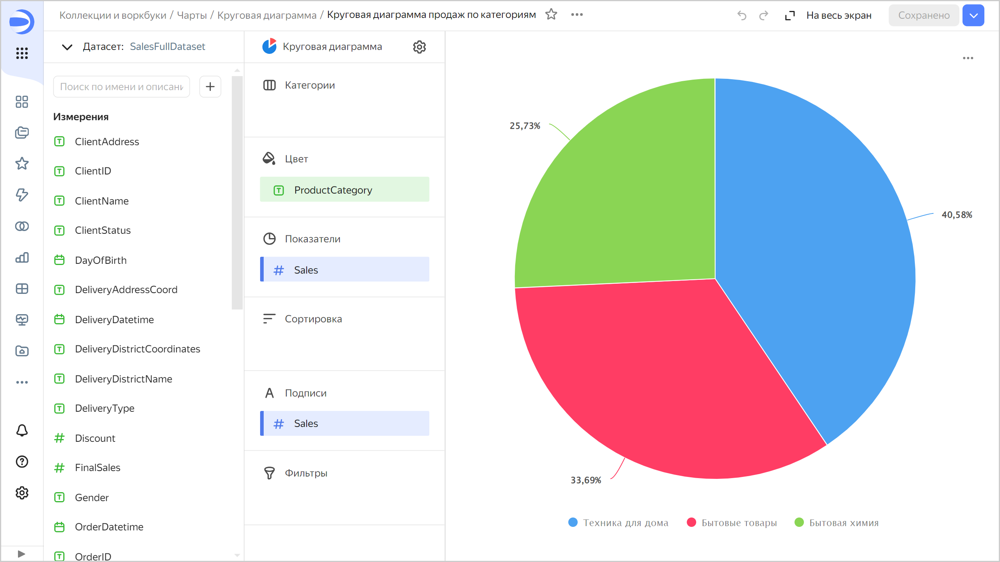
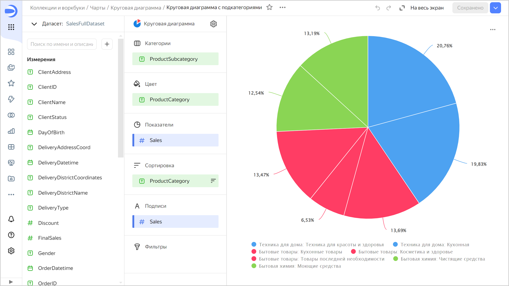

# Круговая диаграмма 

Диаграмма отображает отношение между категориями при помощи сегментов (секторов) круга. Площадь всего круга равна 100% и соответствует сумме всех категорий. Площадь каждого сегмента соответствует доле категории в общей сумме. Круговые диаграммы подходят для показа пропорций небольшого количества сегментов.



Категории товаров | Продажи |	
-----|---------| 
Техника для дома | 69М |
Бытовые товары | 57М |
Бытовая химия | 44М |



Несколько мелких секторов, которые относятся к более крупной категории, можно выделить одним цветом.

## Секции в визарде {#wizard-sections}

Секция  в визарде| Описание
----- | ----
Категории | Измерение. Может быть указано только одно поле. По нему производится группировка данных.
Цвет | Измерение. Может быть указано только одно поле. По нему производится раскрашивание сегментов диаграммы.
Показатели | Показатель. Может быть указано только одно поле.
Сортировка | Показатель или измерение из секции **Цвет**. Влияет на сортировку областей. Направление сортировки отмечено значком рядом с полем: по возрастанию  или по убыванию . Чтобы изменить направление сортировки, нажмите значок.
Подписи | Показатель. Отображает значения показателя на диаграмме. Чтобы добавить на диаграмму выноски с названиями категорий, перетащите в эту секцию измерение [Measure Names](../concepts/chart/measure-values.md). Поддерживается использование [функций разметки](../function-ref/markup-functions.md). Для полей с типом `Строка` можно настроить использование базового синтаксиса [{#T}](../dashboard/markdown.md): нажмите на значок перед названием поля и включите опцию **Markdown**.
Фильтры | Измерение или показатель. Используется в качестве фильтра.

## Создание круговой диаграммы {#create-diagram}

Чтобы создать круговую диаграмму:



1. Перейдите на главную страницу {{ datalens-short-name }}.
1. На панели слева выберите  **Чарты**.
1. Нажмите кнопку **Создать чарт** → **Чарт**.
1. Слева вверху нажмите  **Выберите датасет** и укажите датасет для визуализации.
1. Выберите тип чарта **Круговая диаграмма**.
1. Перетащите измерение из датасета в секцию **Категории**.
1. Перетащите измерение из датасета в секцию **Цвет**.
1. Перетащите показатель из датасета в секцию **Показатели**. Значения отобразятся в виде областей круговой диаграммы.

## Рекомендации {#recommendations}

* При наличии более 4-6 сегментов на одной диаграмме, стоит объединить самые маленькие из них в общую группу **Другие**. Если сегментов больше, диаграмма выглядит перегруженно, а понимать данные становится сложно.
* Объединяйте мелкие сегменты в более крупные группы:
  
  * Для выделения сегментов используйте секцию **Категории**.
  * Для выделения групп используйте секцию **Цвет**.

* На диаграмме нельзя отобразить отрицательные и нулевые значения.
* Не используйте круговые диаграммы для отображения изменения пропорций во времени и для точного сравнения данных по категориям.

#### См. также {#see-also}

* [{#T}](../operations/dashboard/create.md)
* [{#T}](../operations/dashboard/add-chart.md)
* [{#T}](../operations/dashboard/add-selector.md)