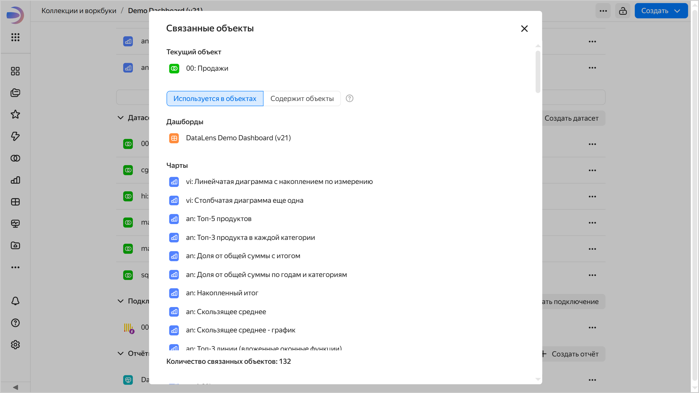

# Воркбуки и коллекции {{ datalens-full-name }}

Сущности {{ datalens-short-name }} размещаются в специальных контейнерах:

* **Воркбук** — хранит [подключения](../concepts/connection.md), [датасеты](../dataset/index.md), [чарты](../concepts/chart/index.md) и [дашборды](../concepts/dashboard.md). Сущности внутри одного воркбука могут ссылаться только друг на друга.
* **Коллекция** — контейнер для группировки воркбуков и других коллекций.

Подробнее о том, как создать воркбук или коллекцию, см. в разделе [{#T}](./workbooks-collections-create.md).

## Просмотр связанных объектов {#related-objects}

Вы можете посмотреть, где используется объект или какие объекты он использует. Для этого на странице воркбука или в окне редактирования объекта нажмите значок  →  **Связанные объекты**. Например, так можно узнать, на каких источниках построен дашборд или какие чарты построены на основе датасета.





Если при открытии окна связанных объектов отображается ошибка, попробуйте нажать кнопку **Повторить**.