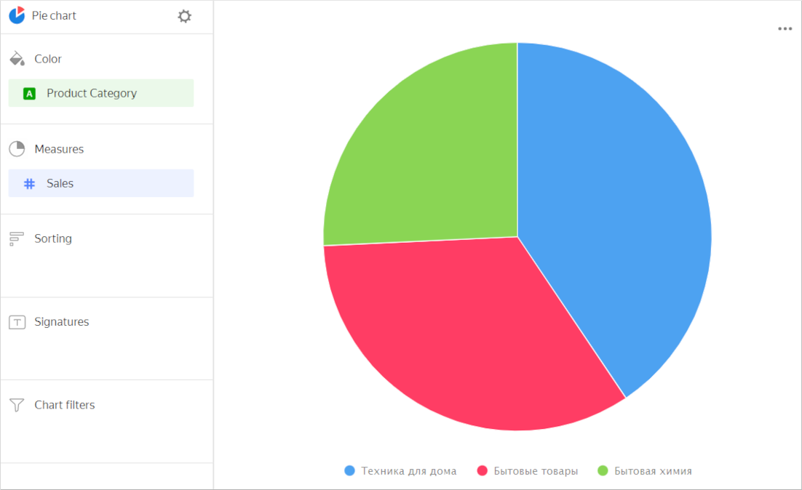

# Pie chart 

This chart shows a proportional relationship of different categories to a total using circle segments (sectors). The entire circle area is 100% and corresponds to the sum of all categories. The area of each segment corresponds to the percentage of a category in the total amount. Pie charts are a good choice for demonstrating proportions of a small number of segments.



| Product categories | Sales |
-----|---------|
| Home appliances | 69M |
| Household goods | 57M |
| Household cleaners | 44M |



## Sections in the wizard {#wizard-sections}

| Section  in the wizard | Description |
----- | ----
| Color | Dimension. Only one field can be specified. |
| Measures | Measure. Only one field can be specified. |
| Sorting | A measure or dimension from the **Color** section. Affects area sorting. The sorting direction is marked with an icon next to the field: ascending  or descending . To change the sorting direction, click the icon. |
| Signatures | Measure. Displays measure values on the chart. To add callouts with category names to the chart, drag the [Measure Names](../concepts/chart/measure-values.md) dimension to this section. |
| Filters | Dimension or measure. Used as a filter. |

## Creating a pie chart {#create-diagram}

To create a pie chart:

1. On the DataLens [home page](https://datalens.yandex.com), click **Create chart**.
1. Under **Dataset**, select a dataset for visualization.
1. Select **Pie chart** as the chart type.
1. Drag a dimension from the dataset to the **Color** section.
1. Drag a measure from the dataset to the **Measures** section. The values are displayed as pie chart areas.

## Recommendations {#recommendations}

* If there are more than 4-6 segments per chart, group the smallest of them as **Other**. A larger number of segments overloads a chart and makes it difficult to understand the data.
* You can't display negative and null values on this type of chart.
* Don't use pie charts to show changes to proportions over time or for precisely comparing data by category.