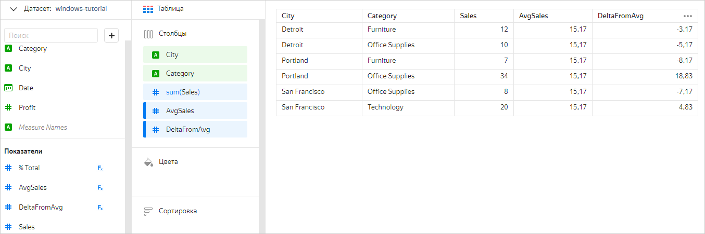
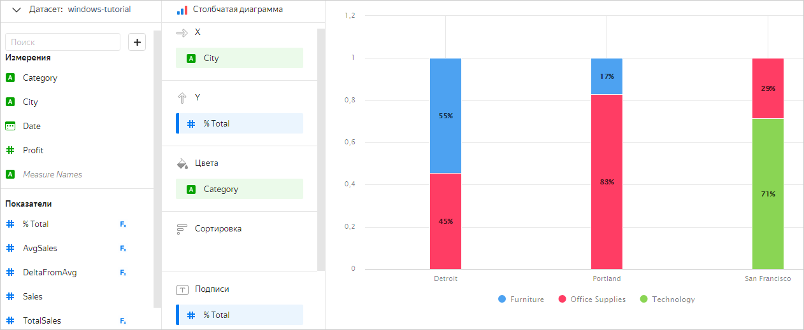
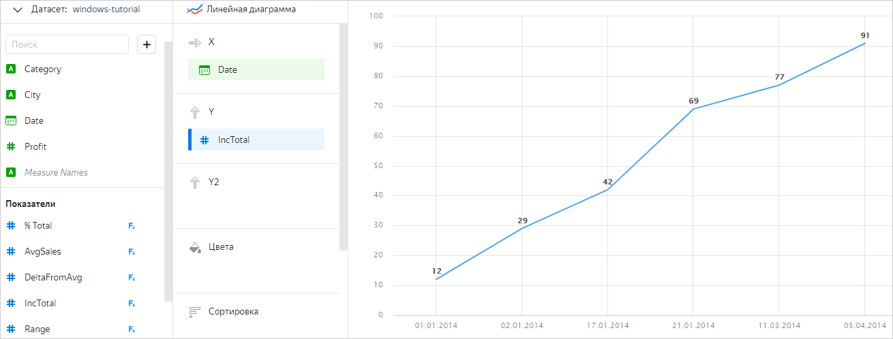
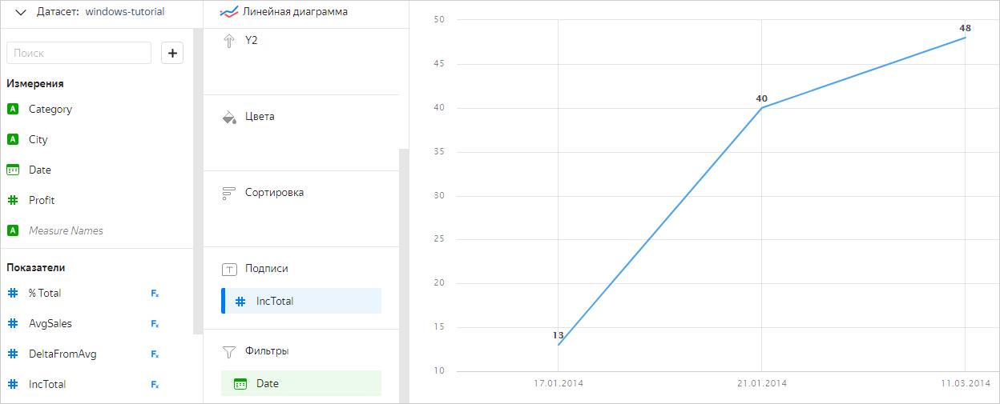
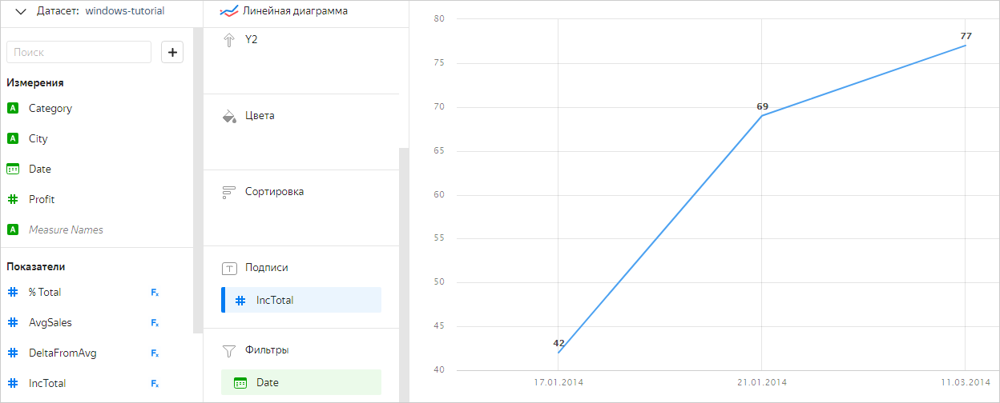
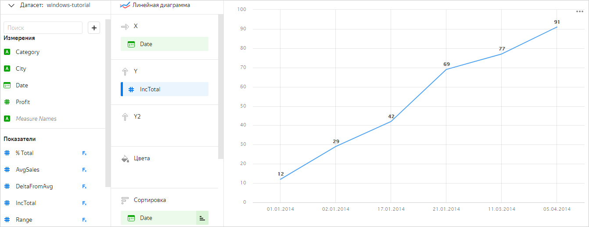
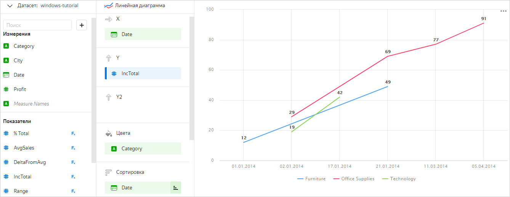
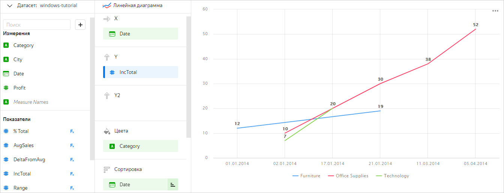

# Оконные функции в DataLens

[Оконные функции](../function-ref/window-functions.md) являются аналогом агрегатных функций. Они позволяют получить дополнительную информацию об исходной выборке, например, вычислить нарастающий итог, скользящее среднее или ранжировать значения. 

Отличие оконных функций от агрегатных состоит в том, что при вычислении оконных функций строки не объединяются в одну, а продолжают существовать отдельно. Результат вычисления функции при этом отображается в каждой строке. Таким образом, исходное количество строк в результате вычисления оконной функции не изменяется. Подробнее о том, как работают агрегация и группировка данных в DataLens, читайте в разделе [{#T}](aggregation-tutorial.md#datalens-aggregation).

## Группировка в оконных функциях {#grouping}

Так же, как и агрегатные функции, оконные функции могут быть вычислены:

* для [одного окна](#one-window-grouping);
* для [нескольких окон](#some-window-grouping).

Побробнее о группировке в оконных функциях читайте в разделе [{#T}](../function-ref/window-functions.md#syntax-grouping).

### Группировка для одного окна {#one-window-grouping}

При таком варианте группировки функция вычисляется для единственного окна, в которое попадают все строки. Для этого используется тип группировки `TOTAL`. Этот тип группировки подходит для подсчета итоговых сумм, ранжирования строк и прочих операций, для которых нужна информация о всех исходных данных.

**Пример**

Необходимо вычислить среднюю сумму продаж (`AvgSales`) и отклонения от нее для каждой категории в городе (`DeltaFromAvg`). Для этого подойдет функция [AVG](../function-ref/AVG_WINDOW.md):

* AvgSales — `AVG(SUM([Sales]) TOTAL)`
* DeltaFromAvg — `SUM([Sales]) - [AvgSales]`

### Группировка для нескольких окон {#some-window-grouping}

Иногда оконную функцию нужно вычислить не среди всех записей, а раздельно по группам. В этих случаях используются типы группировки `WITHIN` и `AMONG`.

#### WITHIN {#within}

`WITHIN` — это аналог `GROUP BY` в `SQL`. В нем перечисляются все измерения, по которым будет производиться разбиение на окна. Также в `WITHIN` можно использовать показатели. В этом случае их значения таким же образом будут участвовать в группировке окна.



В `WITHIN` игнорируются [измерения](aggregation-tutorial.md#dimensions-and-measures), которые не участвуют в группировке чарта. Например, в чарте с группировкой по измерениям `City` и `Category` для показателя `SUM(SUM([Sales]) WITHIN [Date])` измерение `Date` будет проигнорировано, и он станет равносилен показателю `SUM(SUM([Sales]) TOTAL)`.



**Пример**

Вычисление доли каждой категории (`% Total`) от общей суммы продаж по городу (`TotalSales`):

* TotalSales — `SUM(SUM([Sales]) WITHIN [City])`
* % Total — `SUM([Sales]) / [TotalSales]`

Результат на примере чарта **Столбчатая диаграмма**:

#### AMONG {#among}

В этом случае разбиение на окна будет производиться по всем измерениям, которые участвуют в группировке чарта, но не перечислены в `AMONG`. Таким образом, этот тип группировки противоположен типу `WITHIN`. Во время вычисления функции `AMONG` трансформируется в `WITHIN`, который выполняет группировку по всем измерениям, которые не перечислены в `AMONG`.

Так, например, для чарта с группировкой по измерениям `City` и `Category` равносильны показатели:

* `SUM(SUM([Sales]) AMONG [Category])` и `SUM(SUM([Sales]) WITHIN [City])`
* `SUM(SUM([Sales]) AMONG [City], [Category])`и `SUM(SUM([Sales]) TOTAL)`

Такой вариант записи существует исключительно для удобства и применяется в тех случаях, когда заранее неизвестно, в каких измерениях будет строиться чарт, но важно исключить из оконной группировки определенные измерения.



Измерения, перечисленные в `AMONG`, должны быть добавлены в секции чарта. В другом случае чарт вернет ошибку.



## Сортировка {#order-by}

Некоторые оконные функции поддерживают [сортировку](../function-ref/window-functions.md#syntax-order-by), направление которой влияет на расчет значения. Указать сортировку для оконной функции можно следующими способами:

* указать измерения или показатели в секции `ORDER BY`;
* в чарте перенести измерения или показатели в секцию **Сортировка**.

Измерения и показатели для сортировки берутся сначала из секции `ORDER BY` в формуле, а затем из секции чарта **Сортировка**.

**Пример**

Необходимо рассчитать изменение общей суммы продаж (`IncTotal`) за весь период, начиная от самой ранней даты и заканчивая самой поздней. Для этого можно воспользоваться функцией [RSUM](../function-ref/RSUM.md) с сортировкой по измерению `Date` — `RSUM(SUM([Sales]) TOTAL ORDER BY [Date])`.

Результат на примере чарта **Линейная диаграмма**:

Аналогичный результат можно получить, если задать показатель `IncTotal` формулой `RSUM(SUM([Sales]) TOTAL)` и добавить измерение `Date` в секцию **Сортировка**.

## Фильтрация {#before-filter-by}

Вычисление значений функций в чартах выполняется после применения [фильтров](chart/settings.md#filter) по измерениям и показателям, добавленным в секцию **Фильтры**. У оконных функций можно переопределить этот порядок. Для это нужно указать необходимые измерения или показатели в секции `BEFORE FILTER BY` формулы. В таком случае значение функции будет вычислено до применения фильтрации.

Изменение порядка вычисления применяется в том случае, когда нужно рассчитать значение функции для исходного набора данных, но данные в чарте при этом ограничены фильтром.

**Пример**

Необходимо рассчитать изменение общей суммы продаж (`IncTotal`) за период с `17.01.2014` по `11.03.2014`. Если добавить в чарт фильтр по измерению `Date` и создать показатель `RSUM(SUM([Sales]) TOTAL ORDER BY [Date])`, то функция будет рассчитана только для тех данных, которые ограничены фильтром:

Чтобы вычислить функцию для всего объема данных, но отобразить результат только в определенном периоде, необходимо добавить измерение `Date` в секцию `BEFORE FILTER BY` — `RSUM(SUM([Sales]) TOTAL ORDER BY [Date] BEFORE FILTER BY [Date])`.

## Создание показателя для оконной функции {#create-measure}

В качестве первого аргумента (`value` в описании синтаксиса) оконной функции нельзя напрямую использовать [измерение](dataset/data-model.md#field). Сначала нужно применить к нему [функцию агрегации](../function-ref/aggregation-functions.md), в результате чего измерение станет [показателем](dataset/data-model.md#field), который можно использовать в оконной функции.

Например, в чарте с группировкой по измерениям `Year` и `Category` вы хотите ранжировать записи продаж по прибыли за весь период. Нельзя для этого использовать формулу `RANK([Profit])`, где `Profit` — измерение. Сначала надо применить функцию агрегации, чтобы перевести измерение `Profit` в показатель. Наиболее подходящей в данном случае будет агрегатная функция [SUM](../function-ref/SUM.md), которая вернет сумму прибыли: `SUM([Profit])`. Теперь к полученному показателю можно применить оконную функцию ранжирования [RANK](../function-ref/RANK.md). Итоговая корректная формула: `RANK(SUM([Profit]))`.

Показатели можно добавлять как на уровне датасета, так и на уровне чарта. Подробнее см. [{#T}](aggregation-tutorial.md#create-measure).

Чтобы понять, какую именно агрегатную функцию выбрать для перевода измерения в показатель, следует уточнить, какой итоговый показатель вы хотите получить с помощью оконной функции. Например, в чарте с группировкой по категориям товаров (измерение `Category`) требуется упорядочить записи по продажам (измерение `Sales`). Если вы хотите упорядочить записи по сумме продаж, то следует выбрать агрегатную функцию [SUM](../function-ref/SUM.md): `SUM([Sales])`, если по количеству продаж — [COUNT](../function-ref/COUNT.md): `COUNT([Sales])`.

Если требуется получить некоторый строковый показатель, значение которого будет определено путем группировки и сортировки в оконной функции, можно применить агрегатную функцию [ANY](../function-ref/ANY.md).

## Вопросы и ответы {#qa}



   Для правильной работы функций, зависящих от порядка записей в окне (например, [RSUM](../function-ref/RSUM.md), [MAVG](../function-ref/MAVG.md), [LAG](../function-ref/LAG.md), [LAST](../function-ref/LAST.md), [FIRST](../function-ref/FIRST.md)), обязательно указывать сортировку. Это можно сделать следующими способами:

   * перетащить в секцию **Сортировка** измерение или показатель, по которым будет отсортирован весь чарт;
   * задать сортировку для конкретной функции с помощью `ORDER BY`.

 



В качестве примера рассмотрим линейную диаграмму, на которой построен график изменения общей суммы продаж по датам (см. таблицу [Selling](#usage-window-function)). Нарастающий итог (`IncTotal`) вычислен с использованием оконной функции [RSUM](../function-ref/RSUM.md) — `RSUM(SUM([Sales]))`.

Чтобы отобразить изменение суммы продаж по каждой категории товаров, нужно добавить измерение `Category` в секцию **Цвета**.

После этого на диаграмме отобразится отдельный график для каждой категории, но итоговые суммы на них посчитаны неверно: `Furniture` — 49 вместо 19, `Office Supplies` — 91 вместо 52, `Technology` — 42 вместо 20. Это связано с тем, что измерение в секции **Цвета** (`Category`) участвует в группировке так же, как и измерение в секции **X** (`Date`). Чтобы сумма посчиталась корректно, нужно добавить измерение `Category` в секцию `WITHIN` или измерение `Date` в секцию `AMONG`: `RSUM(SUM([Sales]) WITHIN [Category])` или `RSUM(SUM([Sales]) AMONG [Date])`.

 



При добавлении группировки (округления) для даты в чарте исходное поле подменяется на другое, автоматически сгенерированное. Например, при округлении до месяца вместо измерения `[Date]` подставляется новое поле с формулой `DATETRUNC([Date], "month")`. Так как исходное поле `[Date]`  исчезает из перечня измерений чарта, то и оконная функция, в которой оно используется, перестает работать. Для корректной работы функции необходимо в формуле округлить исходное измерение `[Date]` с помощью функции [DATETRUNC](../function-ref/DATETRUNC.md).

 
