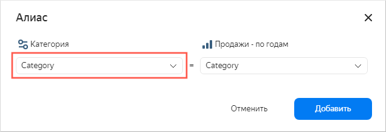

# Добавление селектора на дашборд

Чтобы добавить селектор на дашборд:

1. Откройте дашборд.
1. В верхней части страницы нажмите кнопку **Редактировать**.
1. Нажмите кнопку **Добавить** и выберите **Селектор**.
1. Выберите тип селектора:

	

	- На основе датасета

		Укажите параметры селектора:

		* В блоке **Общие настройки**:

		  * **Датасет**. Определяет датасет с данными для селектора.
		  * **Поле**. Определяет поле датасета со значениями селектора. Может быть как измерением, так и показателем (подробнее см. [{#T}](../../concepts/dataset/data-model.md#field)).
		  * **Тип селектора**. Определяет тип селектора: выпадающий список, поле ввода или календарь. Тип селектора **Календарь** доступен только для полей датасета типа `Дата` или `Дата и время`. Если в **Поле** выбран показатель, то доступен только тип селектора **Поле ввода**.
		  * **Операция**. Определяет операцию сравнения, по которой селектор фильтрует значения чарта (например, **Равно**, **Больше** или **Меньше**). Если оставить поле пустым, селектор по умолчанию будет фильтровать по операции **Равно**. Список доступных операций зависит от типа поля. Не указывайте операцию, если селектор будет фильтровать QL-чарт.
		  * **Множественный выбор**. Определяет возможность выбора нескольких значений. Опция доступна только для селекторов типа **Список**.
		  * **Диапазон**. Определяет возможность выбора временного промежутка. Опция доступна только для селекторов типа **Календарь**.
		  * **Значение по умолчанию**. Отображается изначально при открытии дашборда.

		* В блоке **Внешний вид**:

		  * **Название**. Определяет название селектора. Используется для выбора селектора при установлении связи с другими виджетами. Опция позволяет управлять отображением названия на дашборде.
		  * **Внутренний заголовок**. Текст, который отображается в селекторе для обозначения операции сравнения. Вы можете изменить значение по умолчанию на свое. Например, для операции **Равно** можно указать значение `=` или `равно`. Параметр доступен только для селекторов типа **Список**.  

		    

	- Ручной ввод

		Укажите параметры селектора:

		* В блоке **Общие настройки**:

		  * **Имя поля или параметра**. Задает имя поля, по которому можно установить связь селектора с другими виджетами в окне настройки [алиаса](create-alias.md).

		    

		  * **Тип селектора**. Определяет тип селектора: выпадающий список, поле ввода или календарь.
		  * **Операция**. Определяет операцию сравнения, по которой селектор фильтрует значения чарта (например, **Равно**, **Больше** или **Меньше**). Если оставить поле пустым, селектор по умолчанию будет фильтровать по операции **Равно**. Список доступных операций зависит от типа поля. Не указывайте операцию, если селектор будет фильтровать QL-чарт.
		  * **Множественный выбор**. Определяет возможность выбора нескольких значений. Опция доступна только для селекторов типа **Список**.
		  * **Диапазон**. Определяет возможность выбора временного промежутка. Опция доступна только для селекторов типа **Календарь**.
		  * **Значение по умолчанию**. Отображается изначально при открытии дашборда. Это поле является обязательным для селектора типа **Список**: если его не заполнить, в селекторе не будет доступно ни одного значения.

		* В блоке **Внешний вид**:

		  * **Название**. Определяет название селектора. Используется для выбора селектора при установлении связи с другими виджетами. 

		    

		    Опция позволяет управлять отображением названия на дашборде.

		  * **Внутренний заголовок**. Текст, который отображается в селекторе для обозначения операции сравнения. Вы можете изменить значение по умолчанию на свое. Например, для операции **Равно** можно указать значение `=` или `равно`. Параметр доступен только для селекторов типа **Список**. 

		    
   
	
   

   Для [QL-чартов](../../concepts/chart/index.md#sql-charts) в области редактирования чарта на вкладке **Параметры** можно управлять [параметрами селектора](../chart/create-sql-chart.md#selector-parameters), а на вкладке **Запрос** указывать переменную в самом запросе в `not_var{{variable}}` формате.

1. Нажмите кнопку **Добавить**. Виджет отобразится на дашборде.



При добавлении селектора по полю на дашборд фильтры, добавленные на уровне чарта, перестают применяться к графику на дашборде.



## Ограничения {#restrictions}

* Для селекторов по показателям доступен только один тип селектора — **Поле ввода**.
* Селекторы по показателям рекомендуется делать только независимыми от других селекторов (необходимо для них задать тип [связи](../../dashboard/link.md) **Игнор** с другими селекторами в разделе **Связи** при редактировании дашборда).
