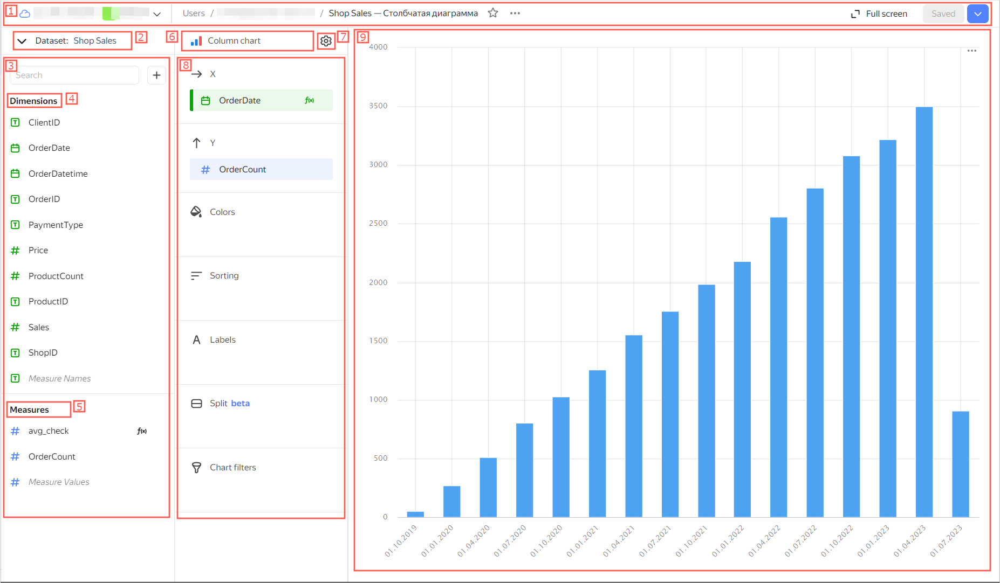

# Wizard charts

Charts are created in a wizard based on data from dataset.

The workspace in the wizard interface is divided into three main panels:

1. A dataset panel where available fields are displayed: **Dimensions** and **Measures**. You can add a [calculated field](../calculations/index.md) to the list.
1. A visualization setup panel that you can use to select a [chart type](../../visualization-ref/index.md). Each type has its own set of sections (such as X-axis, Y-axis, and filters) where you can drag and drop fields. For more information, see [{#T}](settings.md).
1. A preview panel where the visualization is displayed.

Charts let you quickly analyze and test hypotheses. You can also save charts and add them to dashboards as widgets.



DataLens limits the number of data rows displayed in charts. For more information, see [{#T}](../limits.md).



When opening a chart in a wizard:

* At the top (1), you can see general information: location, name, controls, as well as controls and saves common for all charts.
* At the bottom-left (2), you can select a [dataset](../dataset/index.md) to create a widget. After the dataset is selected, a list of fields (3) that can be used in the chart appears below it. The fields are grouped into [Dimensions (4) and Measures (5)](../dataset/data-model.md#field).
* On the right, you can see a button to select a chart type (6) and the  icon to open the general settings (7). Once the chart type is selected, you will see a list of sections (8) below. Its structure depends on the selected chart type.
* The Preview area (9) is on the right of the window.

