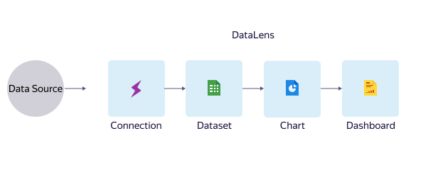

# About

DataLens is a business analytics service. It allows you to connect to various data sources, visualize data, create dashboards, and share your results.
With DataLens, you can track your product and business metrics directly from data sources to make data-based decisions.

## Relationship between entities {#component-interrelation}

DataLens consists of multiple entities that ensure the full data cycle.

DataLens includes the following entities:

- **Connection**: A set of parameters for accessing a data source.
- **Dataset**: A description of a dataset from a source.
- **Chart**: Data from a data source or a dataset visualized as tables, diagrams, or maps.
- **Dashboard**: A set of charts, selectors for filtering data, and text blocks.

