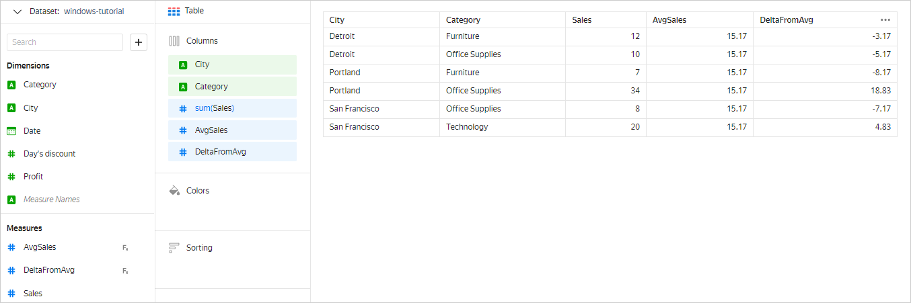
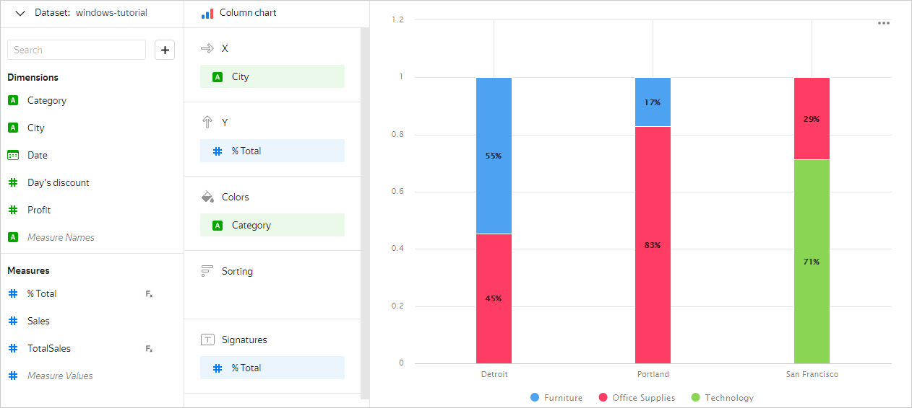
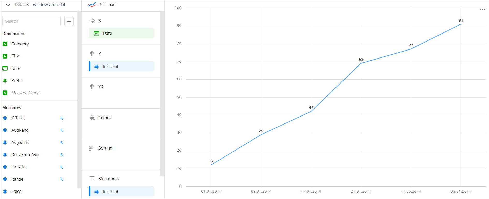
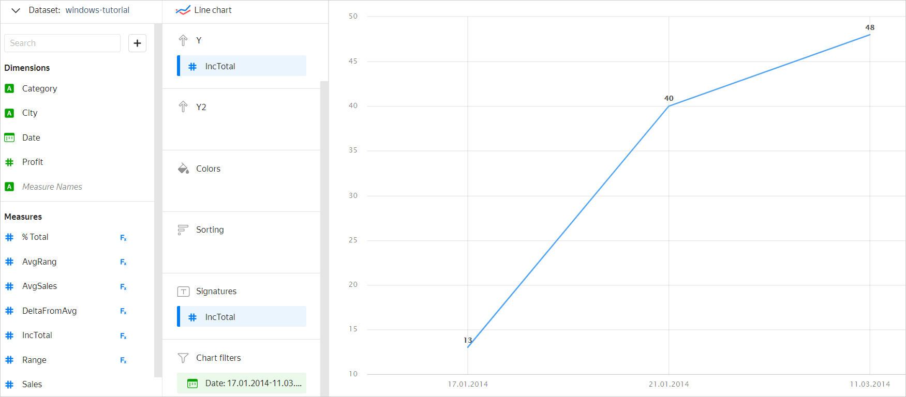
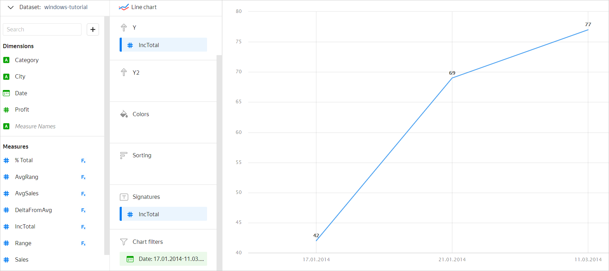
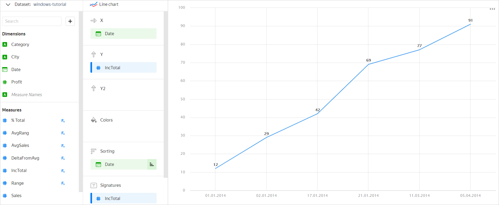
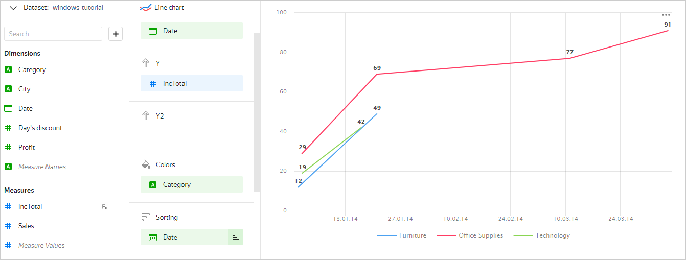
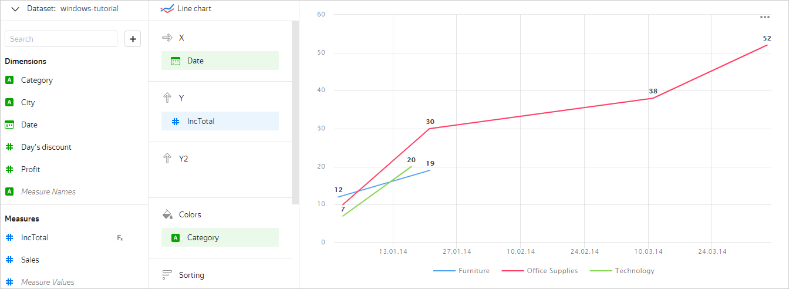

# Window functions in DataLens

[Window functions](../function-ref/window-functions.md) are similar to aggregate functions. They allow you to get additional information about the original sample. For example, you can calculate the cumulative total and the moving average or rank values.

The difference is that when calculating window functions, the rows are not combined into one but continue to be separate. The result of the calculation is displayed in each row. The original number of rows doesn't change. For more detail on data aggregate and grouping in DataLens, please review [{#T}](aggregation-tutorial.md#datalens-aggregation).

## Grouping in window functions {#grouping}

Just like aggregate functions, window functions can be calculated:

* For a [single window](#one-window-grouping).
* For [several windows](#some-window-grouping).

For more information on groupings in window functions, please review under [{#T}](../function-ref/window-functions.md#syntax-grouping).

### Grouping for a single window {#one-window-grouping}

With this grouping option, the function is calculated for a single window that includes all the rows. The `TOTAL` grouping is used. It enables you to calculate totals, rank rows, and perform other operations that require information about all the source data.

**Example**

You need to calculate the average sales amount (`AvgSales`) and deviations from it for each category in the city (`DeltaFromAvg`). The best function for this is [AVG](../function-ref/AVG_WINDOW.md):

* AvgSales — `AVG(SUM([Sales]) TOTAL)`
* DeltaFromAvg — `SUM([Sales]) - [AvgSales]`

### Grouping for multiple windows {#some-window-grouping}

Sometimes the window function needs to be calculated separately by group, and not across all records. In this case, the `WITHIN` and `AMONG` groupings are used.

#### WITHIN {#within}

`WITHIN`: Similar to `GROUP BY` in `SQL`. It lists all the dimensions by which splitting into windows is performed. In `WITHIN`, you can also use measures. In this case their values are similarly included in the window grouping.



In `WITHIN`, the [dimensions](aggregation-tutorial.md#dimensions-and-measures) that aren't included in chart grouping are ignored. For example, in a chart grouped by the `City` and `Category` dimensions for the `SUM(SUM([Sales]) WITHIN [Date])` measure, the `Date` dimension is ignored and it becomes the same as the `SUM(SUM([Sales]) TOTAL)` measure.



**Example**

Calculating the share of each category (`% Total`) of the total sales amount by city (`TotalSales`):

* TotalSales: `SUM(SUM([Sales]) WITHIN [City])`
* % Total: `SUM([Sales]) / [TotalSales]`

For example, this is the result for the **Column chart**:

#### AMONG {#among}

In this case, splitting into windows is performed for all dimensions that are included in the chart grouping but are not listed in `AMONG`. That's why this grouping type is contrary to `WITHIN`. When calculating the function, `AMONG` transforms to `WITHIN`, which performs grouping by all dimensions that are not listed in `AMONG`.

For example, for a chart with grouping by the `City` and `Category` dimensions, the following measures are the same:

* `SUM(SUM([Sales]) AMONG [Category])` and `SUM(SUM([Sales]) WITHIN [City])`
* `SUM(SUM([Sales]) AMONG [City], [Category])`and `SUM(SUM([Sales]) TOTAL)`.

This option is provided only for convenience and is used when you do not know which dimensions the chart will be built across in advance, but you need to exclude certain dimensions from the window grouping.



The dimensions listed in `AMONG` should be added to the chart sections. Otherwise, the chart returns an error.



## Sorting {#order-by}

Some window functions support [sorting](../function-ref/window-functions.md#syntax-order-by), the direction of which affects the calculation value. To specify sorting for the window function:

* Specify dimensions or measures in the `ORDER BY` section.
* In the chart, move the dimensions or measures to the **Sorting** section.

Dimensions and measures for sorting are first taken from the `ORDER BY` section in the formula and then from the **Sorting** chart section.

**Example**

You need to calculate the change in the total sales amount (`IncTotal`) for the entire period, from the earliest to the latest date. To do this, you can use the [RSUM](../function-ref/RSUM.md) function sorted by the `Date` dimension: `RSUM(SUM([Sales]) TOTAL ORDER BY [Date])`.

Result for an example **Line chart**:

You'll get a similar result if you set the `IncTotal` measure with the `RSUM(SUM([Sales]) TOTAL)` formula and add the `Date` dimension to the **Sorting** section.

## Filtering {#before-filter-by}

Function values in charts are calculated after applying [filters](chart/settings.md#filter) across the dimensions and measures added to the **Filters** section. For window functions, you can override this order. To do this, specify the necessary dimensions or measures in the `BEFORE FILTER BY` section of the formula. In this case, the function value is calculated before filtering is applied.

The calculation order is changed when you need to calculate the function value for the original dataset but the chart data is limited by the filter.

**Example**

You need to calculate the change in the total sales amount (`IncTotal`) for the period from `17.01.2014` through `11.03.2014`. If you add a `Date` filter and create the `RSUM(SUM([Sales]) TOTAL ORDER BY [Date])` measure, the function is calculated only for the data limited by the filter:

To calculate a function for all the data, but only display the result for a certain period, you need to add the `Date` dimension to the `BEFORE FILTER BY` section: `RSUM(SUM([Sales]) TOTAL ORDER BY [Date] BEFORE FILTER BY [Date])`.

## Creating measures for a window function {#create-measure}

You can't use a [dimension](dataset/data-model.md#field) directly as the first argument (`value` in the syntax description) of a window function. You should first apply an [aggregation function](../function-ref/aggregation-functions.md) to it so that a dimension becomes a [measure](dataset/data-model.md#field) that can be used in window functions.

For example, you want to rank sales records by profit over the entire period in a chart with data grouped by the `Year` and `Category` dimensions. To do this, you can't use the `RANK([Profit])` formula, where `Profit` is a dimension. You need to apply an aggregation function first to convert the `Profit` dimension into a measure. The most suitable aggregate function here is [SUM](../function-ref/SUM.md) that returns the amount of profit: `SUM([Profit])`. Next, apply the [RANK](../function-ref/RANK.md) window function to the resulting measure. The correct resulting formula is `RANK(SUM([Profit]))`.

You can add measures both at the dataset and the chart level. For details, see [{#T}](aggregation-tutorial.md#create-measure).

To understand what aggregate function to select for converting dimensions into measures, specify what resulting measure you want to get using a window function. For example, in a chart with data grouped by product `Category`, you need to order records by `Sales`. To order records by sales amount, choose the [SUM](../function-ref/SUM.md) aggregate function: `SUM([Sales])`. To order them by sales count, choose [COUNT](../function-ref/COUNT.md): `COUNT([Sales])`.

If you need to get a string measure with a value determined by grouping and sorting data in a window function, use the [ANY](../function-ref/ANY.md) aggregate function.

## Questions and answers {#qa}



For functions that depend on the order of entries in the window (for example, [RSUM](../function-ref/RSUM.md), [MAVG](../function-ref/MAVG.md), [LAG](../function-ref/LAG.md), [LAST](../function-ref/LAST.md), or [FIRST](../function-ref/FIRST.md)) to work correctly, you must specify sorting. To do this:

* Drag the dimension or measure to sort the chart by to the **Sorting** section.
* Set sorting for a specific function using `ORDER BY`.





As an example, let's consider a line chart showing a plot of the change in total sales by date (see [Selling](#usage-window-function) table.). The cumulative total (`IncTotal`) is calculated using the [RSUM](../function-ref/RSUM.md) window function: `RSUM(SUM([Sales]))`.

To display the change in the sales amount for each product category, add the `Category` dimension to the **Colors** section.

After that, the chart displays a separate graph for each category but the totals are calculated incorrectly: for `Furniture`, it's 49 instead of 19, for `Office Supplies`, 91 instead of 52, for `Technology`, 42 instead of 20. This is because the dimension in the **Colors** (`Category`) section is included in the grouping the same way as the dimension in the **X** section (`Date`). To calculate the amount correctly, you need to add the `Category` dimension to the `WITHIN` section or the `Date` dimension to the `AMONG` section: `RSUM(SUM([Sales]) WITHIN [Category])` or `RSUM(SUM([Sales]) AMONG [Date])`.





When adding a grouping (rounding) for a date in the chart, the original field is replaced with an automatically generated one. For example, when rounding to a month, the `[Date]` dimension is replaced with a new field using the `DATETRUNC([Date], "month")` formula. Because the original `[Date]` field disappears from the list of chart dimensions, the window function it's used in no longer works. For the function to work correctly, you need to round the original `[Date]` dimension in the formula using the [DATETRUNC](../function-ref/DATETRUNC.md) function.


