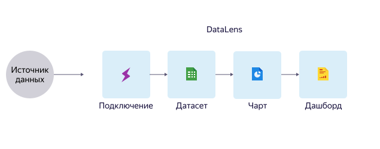

# О сервисе

DataLens — это сервис для бизнес-аналитики. Сервис позволяет подключаться к различным источникам данных, строить визуализации, собирать дашборды и делиться полученными результатами.
С помощью DataLens вы можете отслеживать продуктовые и бизнес-метрики напрямую из источников, чтобы принимать решения, основанные на данных.

## Взаимосвязь сущностей {#component-interrelation}

DataLens состоит из нескольких сущностей, которые обеспечивают полный цикл работы с данными.

DataLens состоит из следующих сущностей:

- **Подключение** — набор параметров для доступа к источнику данных.
- **Датасет** — описание набора данных из источника.
- **Чарт** — визуализация данных из источника данных, датасета в виде таблиц, диаграмм и карт.
- **Дашборд** — набор чартов, селекторов для фильтрации данных и текстовых блоков.

